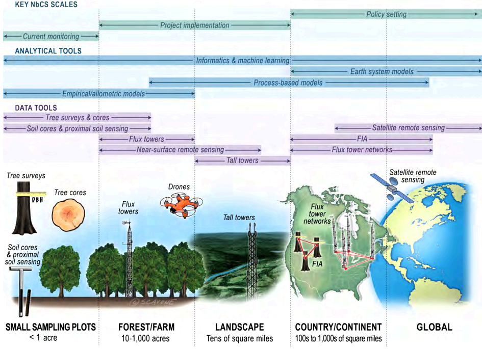

<!DOCTYPE html>
<html lang="en">

<head>
    <meta charset="UTF-8">
    <meta http-equiv="X-UA-Compatible" content="IE=edge">
    <meta name="viewport" content="width=device-width, initial-scale=1.0">
    <title>Nature-based Climate Solutions</title>
    <link rel="stylesheet" href="styles.css"> <!-- Assuming you have a CSS file named 'styles.css'. If not, you can remove this line. -->
</head>

<body>

    <section id="intro">
        <h1>Understanding Nature's Role in Climate Solutions</h1>
        

            Farmers and land stewards have a unique opportunity to play a major role in combatting climate change. Nature-based Climate Solutions (NbCS) are management techniques that enhance the sequestration of carbon dioxide and reduce greenhouse gas emissions in croplands, grasslands, forests, and wetlands. In addition to aiding in the fight against global warming, NbCS provides numerous benefits such as improved soil health, better air and water quality, and increased resilience against climate threats like floods and droughts.
        

    </section>

    <section id="flux-tower">
        <h2>The Significance of Flux Towers</h2>
        

            However, to successfully implement NbCS, we need reliable data to ensure these strategies truly benefit the climate. This is where flux towers come into the picture.
        

        

            Imagine a lighthouse that doesn’t guide ships but instead gathers vital data from the surrounding environment. <strong>Flux towers</strong> are like these lighthouses, standing tall amidst fields, forests, and wetlands, continuously collecting essential data. Each tower, covering anywhere from 10 to 1,000 acres, is equipped with sophisticated instruments that measure the exchange of carbon dioxide, water vapor, and energy between the earth and the atmosphere. By analyzing the tiniest of changes in the air, flux towers give us a clear picture of how gases and energy move in and out of an ecosystem. In essence, they help us monitor the health of our lands and the success of our conservation efforts.
        

    </section>

<section id="video">
    <h3>What is a Flux Tower?</h3>
    

        The National Ecological Observatory Network (NEON) provides a comprehensive overview of flux towers and eddy covariance in the video below:
    

    <iframe width="560" height="315" src="https://www.youtube.com/embed/CR4Anc8Mkas" title="Flux Tower Explanation by NEON" frameborder="0" allow="accelerometer; autoplay; clipboard-write; encrypted-media; gyroscope; picture-in-picture" allowfullscreen></iframe>
    

        <a href="https://www.neonscience.org/impact/observatory-blog/ameriflux-and-neon-program-join-forces-eddy-covariance-data" target="_blank" rel="noopener noreferrer">Sourced from NEON</a>
    

</section>

    <section id="image">
        <h3>Monitoring Scales for NbCS</h3>
        

            Understanding the diverse scales of monitoring is crucial for the successful implementation of NbCS. The image below offers a comparative view:
        

        
    </section>

    <!-- You can continue with other sections or include a footer etc. -->

</body>

</html>
