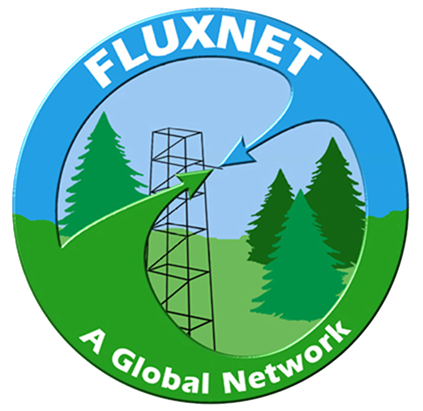

<head>
    <meta charset="UTF-8">
    <meta http-equiv="X-UA-Compatible" content="IE=edge">
    <meta name="viewport" content="width=device-width, initial-scale=1.0">
    <title>Nature-based Climate Solutions</title>
    <link rel="stylesheet" href="styles.css"> <!-- Assuming you have a CSS file named 'styles.css'. -->
    
</head>

  
<body>

<!-- Add the banner grid-container here -->

  

    <a href="https://kesondrakey.github.io/DownforMaintenance">
      
      
Meet the Teams &#8594;
 <!-- Added arrow here -->
    </a>
  

  <i>Image is of the Morgan Monroe Flux Tower. Bloomington, IN</i>

<!-- end the banner grid-container here -->
    
    

        

            <section id="flux-tower">
                <h1>The Significance of Flux Towers</h1>
                

                Flux towers, also known as Eddy Covariance systems, are like high-tech weather stations, but with a special focus. Imagine them as detectives that can capture tiny bits of air, known as eddys, and analyze what's in them. These towers stand in places like fields, forests, or wetlands and help scientists understand how much carbon dioxide and water vapor is moving in and out of an area at any given time. They're equipped with advanced scientific sensors that measure all sorts of variables (carbon dioxide, water vapor, soil moisture/temperature, precipitation, and energy), giving us critical information about the health of our planet
                

                

                    By analyzing the tiniest of changes in the air, flux towers give us a snapshot of how gases and energy move in and out of an ecosystem. With long time series, we can detect important changes in these systems. 
                

            </section>

            <section id="video">
                

                    The National Ecological Observatory Network (NEON) provides a comprehensive overview of flux towers and eddy covariance in the video below:
                

                <iframe width="560" height="315" src="https://www.youtube.com/embed/CR4Anc8Mkas" title="Flux Tower Explanation by NEON" frameborder="0" allow="accelerometer; autoplay; clipboard-write; encrypted-media; gyroscope; picture-in-picture" allowfullscreen></iframe>
                

    <a href="https://www.neonscience.org/impact/observatory-blog/ameriflux-and-neon-program-join-forces-eddy-covariance-data" target="_blank" rel="noopener noreferrer">Sourced from NEON</a>
                    

          

                  <i>  Data sourced from this project will later be submitted to Ameriflux and Fluxnet </i>
                

                
            </section>

  
  

