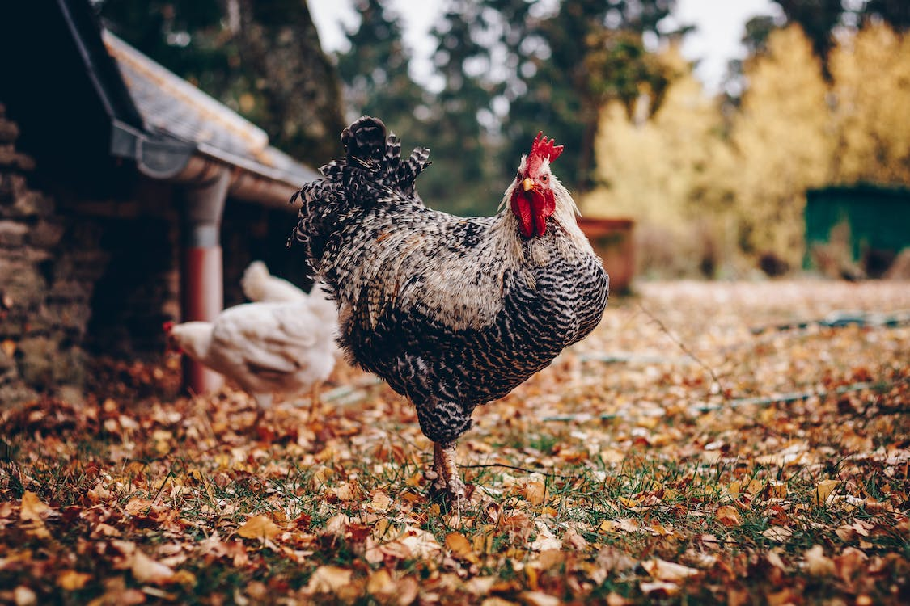

A comprehensive resource showcasing invaluable data from four agricultural sites in Indiana

<html>
<head>

</head>
<body>
  

    

      <a href="https://kesondrakey.github.io/fluxtower1">
        
        
Flux Tower 1

      </a>
    

    

      <a href="https://kesondrakey.github.io/fluxtower2">
        
        
Flux Tower 2

      </a>
    

    

      <a href="https://kesondrakey.github.io/fluxtower3">
        
        
Flux Tower 3

      </a>
    

    

      <a href="https://kesondrakey.github.io/fluxtower4">
        
        
Flux Tower 4

      </a>
    

    

  <a href="https://kesondrakey.github.io/TowerComparisons">
    
    
Tower Comparisons

  </a>

  

</body>
</html>

