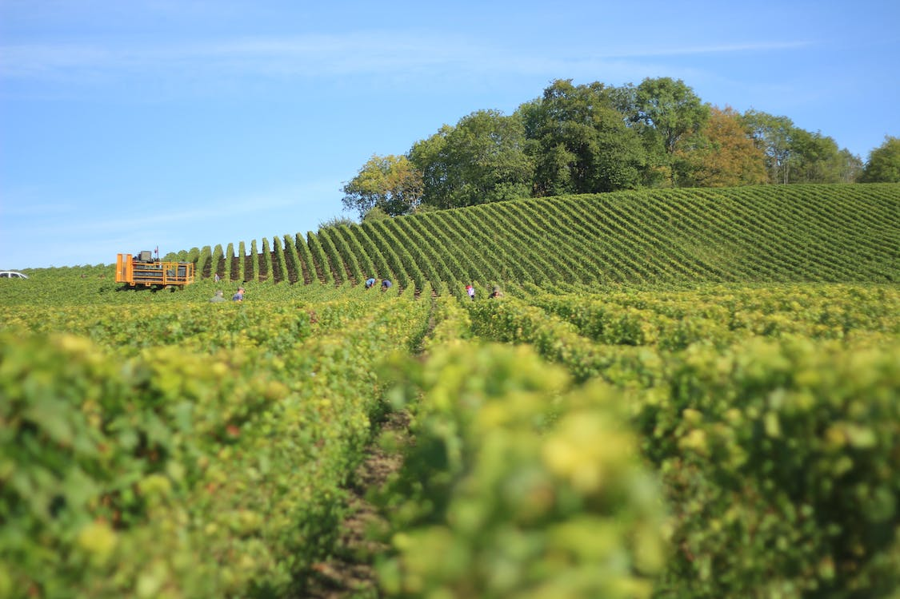

# kesondrakey.github.io
A comprehensive resource showcasing invaluable data from four distinct agricultural sites in Indiana

---
layout: post
title: Nature Based Climate Solutions tst
---

---
[About the Project](https://kesondrakey.github.io/about_project)
---
[About the Team](https://kesondrakey.github.io/about_team)
---

<html>
<head>
  
</head>
<body>
  

    

      
    

    

      
    

    

      
    

    

      
    

  

</body>
</html>

