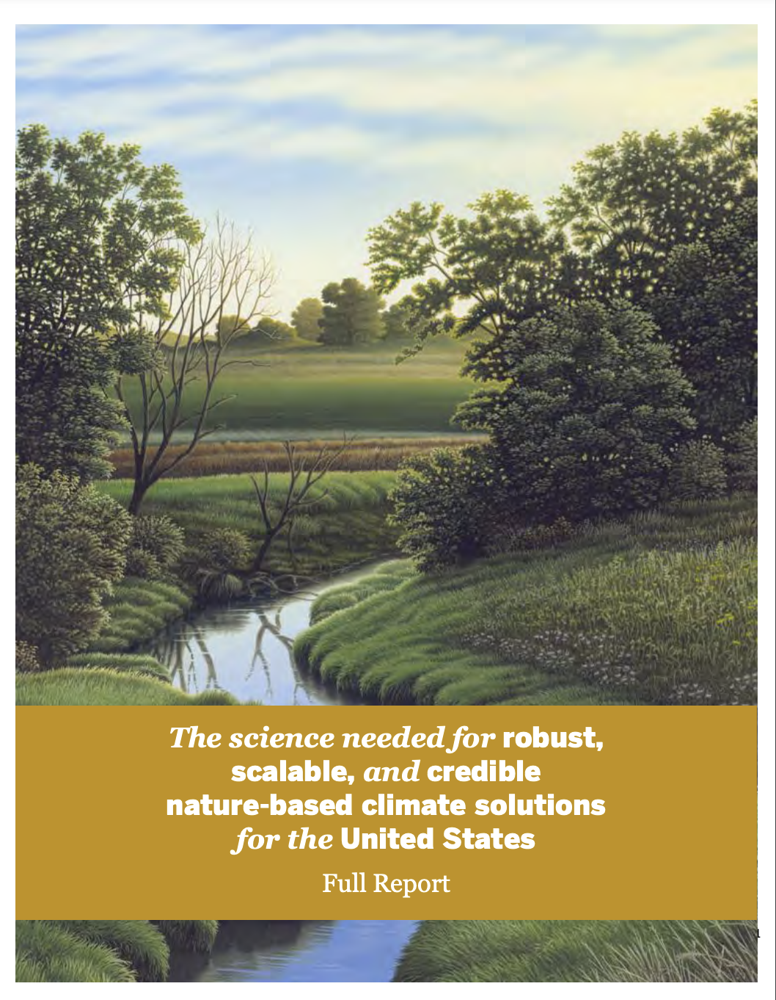

<html>
<head>
  
</head>
<body>
    <!-- Banner -->
    <section id="banner" class="major">
        

            <header class="major">
                <h1>Nature Based Climate Solutions</h1>
            </header>
            

                <ul class="actions">
                </ul>
            

        

    </section>

   
<strong>Overview:</strong>strong>

    
Nature-based climate solutions (NbCS) offer a promising avenue to combat climate change by leveraging natural processes to reduce greenhouse gas concentrations. Some of these strategies include reforestation, climate-smart agriculture, and wetland restoration. Despite garnering significant bipartisan support and private sector interest, the scientific frameworks guiding NbCS implementation and monitoring are yet to be fully established. That is where this project comes in.

    
<strong>Objective:</strong>

    
This initiative aims to provide a scientific roadmap to ensure robust, scalable, and credible NbCS in the U.S. It focuses on identifying knowledge gaps, integrating the best available tools, and offering actionable cross-sectoral data. By understanding both the technical and socio-economic potential of NbCS, we can steer our efforts towards strategies that genuinely mitigate climate change impacts.

    

        

            
<strong>Key Highlights:</strong>

            <ul>
                <li><strong>The Need:</strong> As the climate crisis intensifies, simply reducing greenhouse gas emissions may not suffice. Complementing this with NbCS, which targets atmospheric greenhouse gas emission reduction, can bolster our fight against climate change</li>
                <li><strong>Benefits Beyond Climate Mitigation:</strong> NbCS not only aids in climate mitigation but also positively impacts biodiversity, air and water quality, soil health, and boosts ecosystem resilience</li>
                <li><strong>Criteria for Success:</strong> For NbCS to be effective, they must meet four essential criteria: additional enhancements to carbon uptake, net cooling effect, durability of carbon storage, and accounting for leakage</li>
                <li><strong>Challenges and Uncertainties:</strong> The current scientific knowledge lacks a complete understanding of NbCS impacts across varying scales, raising questions about their overall efficacy</li>
                <li><strong>Bridging the Gap:</strong> Over the years, technological advancements and innovative measurement tools have provided insights into the ecosystem carbon cycles. By integrating these tools and technologies, we can develop a comprehensive NbCS "Information Network," a cornerstone in guiding the implementation of effective NbCS strategies</li>
            </ul>
        

        

            
            
Join Us:

            
Explore our in-depth report, be part of the conversation, and help us shape a sustainable future.

        

    

</body>
</html>
