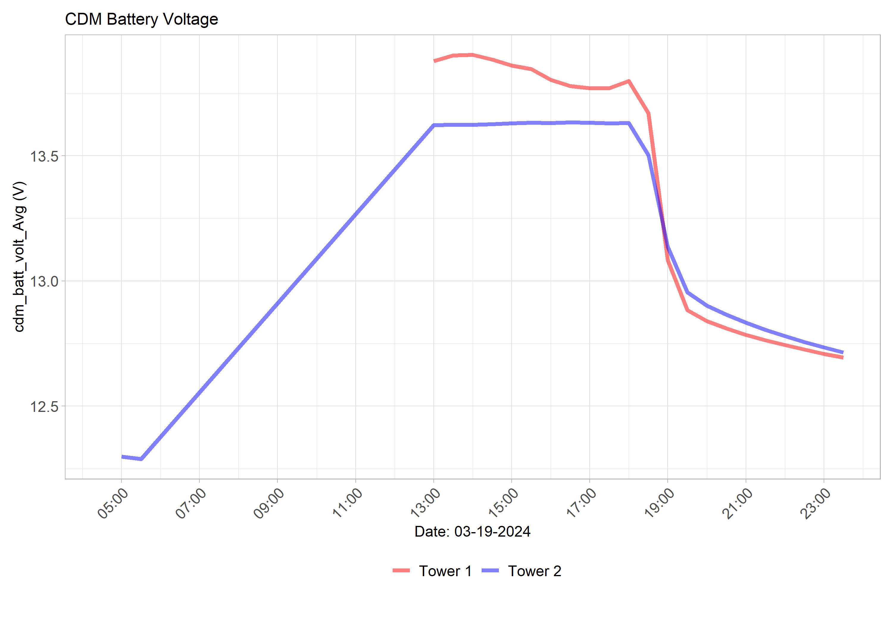

<!-- Wind section: -->

<button class="collapsible battery">Battery</button>

<!-- Start cdm_batt_volt_Avg: -->
<h2>CDM Battery Data (cdm_batt_volt_Avg)</h2>

  <!-- Fluxtower 1_2 Plots -->
  

    <h4>Flux Towers 1 & 2 - Yesterday</h4>
    
  

  

    <h4>Flux Towers 1 & 2 - Today</h4>
    
  

  

  <!-- Fluxtower 3_4 Plots -->
  

    <h4>Flux Towers 3 & 4 - Yesterday</h4>
    
  

  

    <h4>Flux Towers 3 & 4 - Today</h4>
    
  

<!-- end cdm_batt_volt_Avg: -->
            

 <!-- This is the closing tag for content div under Soil -->

 <!-- This is the closing tag for collapsibleContainer div under Soil -->
<!-- END Battery section: -->
 
