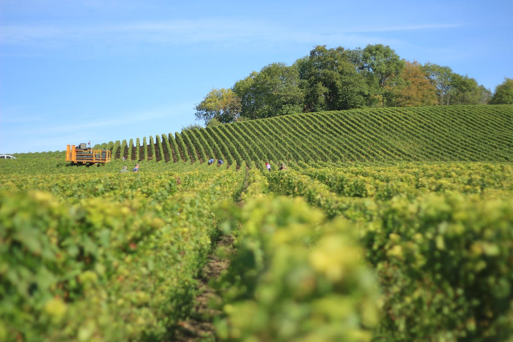

<h1>Timeseries </h1>
<html>
<head>
  
</head>
<body>
  

    

      <!-- Here's where you add the iframe to embed the Plotly graph -->
      <iframe width="100%" height="400" frameborder="0" scrolling="no" src="https://rawcdn.githack.com/kesondrakey/kesondrakey.github.io/d7d6c8619bd58493be9406344f4e9e6830b1f298/longterm_plots/longterm_plotly_fluxtower1.html"></iframe>
    

    

      
    

  

</body>
</html>

<h2>Daily Plots </h2>

<html>
<head>
  
</head>
<body>
  

    

      <a href="https://kesondrakey.github.io/fluxtower1/precip">
        
        Precipitation
      </a>
    

    

      <a href="https://kesondrakey.github.io/fluxtower1/temp">
        
        Temperature
      </a>
    

    

      <a href="https://kesondrakey.github.io/fluxtower1/wind">
        
        Wind
      </a>
    

    

      <a href="https://kesondrakey.github.io/fluxtower1/soil">
        
        Soil
      </a>
    

    

      <a href="https://kesondrakey.github.io/fluxtower1/netrad">
        
        Net Radiation
      </a>
    

    

      <a href="https://kesondrakey.github.io/fluxtower1/other">
        
        Other
      </a>
    

  

</body>
</html>

