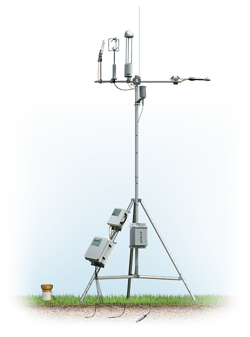

<html>
<head>
  
</head>

<body>
  <h1>Long Term Data</h1>
  

    

      <!-- Here's where you add the iframe to embed the Plotly graph -->
      <iframe width="100%" height="400" frameborder="0" scrolling="no" src="longterm_plots/longterm_daily_plotly_fluxtower1.html">
      </iframe>
    

  
 

 
<!-- Toggle Icons -->

   
   
   

<!-- Data Tables -->

    <h1>Daily Data</h1>
    

        <iframe width="100%" height="430" frameborder="0" scrolling="no" src="longterm_plots/datatable_daily_fluxtower1.html"></iframe>
    

    <h1>Weekly Data</h1>
    

        <iframe width="100%" height="430" frameborder="0" scrolling="no" src="longterm_plots/datatable_daily_fluxtower1.html"></iframe>
    

    <h1>Monthly Data</h1>
    

        <iframe width="100%" height="430" frameborder="0" scrolling="no" src="longterm_plots/datatable_daily_fluxtower1.html"></iframe>
    

<button class="collapsible">More Technical Data</button>

<h1>Long Term Data</h1>
  
  

    

      <!-- Here's where you add the iframe to embed the Plotly graph -->
      <iframe width="100%" height="800" frameborder="0" scrolling="no" src="longterm_plots/longterm_plotly_fluxtower1.html">
      </iframe>
    

  

  <h4><i>*Click your variable of interest</i></h4>

 

function adjustIframeHeight() {
    const iframes = document.querySelectorAll('.html-object iframe');
    iframes.forEach(iframe => {
        if (window.innerWidth <= 768) {
            iframe.style.height = `calc(50vw)`;  // Adjust as needed
        } else {
            iframe.style.height = '600px'; // Adjust as needed for larger screens
        }
    });
}

window.addEventListener('resize', adjustIframeHeight);
window.addEventListener('DOMContentLoaded', adjustIframeHeight); // To adjust the height on page load

<!-- Rest of your content... -->
</body>
</html>
