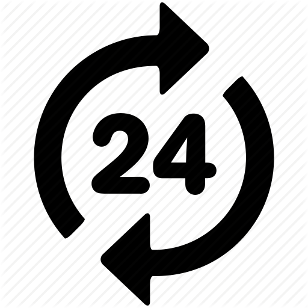

<html>
<head>
  
</head>
<body>
  

  <h1>Long Term Data</h1>
  

    

      <!-- Here's where you add the iframe to embed the Plotly graph -->
      <iframe width="100%" height="400" frameborder="0" scrolling="no" src="longterm_plots/longterm_daily_plotly_fluxtower1.html">
      </iframe>
      <i>*Precipitation (sum, inches); Temperature (average °F); Soil Water Content (soil_water_Avg.1.; averaged volumetric water fraction (m^3/m^3))</i>
    

  
 

 
<!-- Toggle Icons -->

    

        Daily <!-- The new label -->
        
    

    

        Weekly <!-- The new label -->
        
    

    

        Monthly <!-- The new label -->
        
    

<!-- Data Tables -->
  

      <h1>Daily Data</h1>
      

          <iframe width="100%" height="400" frameborder="0" scrolling="no" src="longterm_plots/datatable_daily_fluxtower1.html"></iframe>
        <i>*Precipitation (sum, inches); Temperature (average °F); Soil Water Content (soil_water_Avg.1.; averaged volumetric water fraction (m^3/m^3))</i>
      

  

  

      <h1>Weekly Data</h1>
      

          <iframe width="100%" height="400" frameborder="0" scrolling="no" src="longterm_plots/datatable_weekly_fluxtower1.html"></iframe>
        <i>*Precipitation (sum, inches); Temperature (average °F); Soil Water Content (soil_water_Avg.1.; averaged volumetric water fraction (m^3/m^3))</i>
      

  

  

      <h1>Monthly Data</h1>
      

          <iframe width="100%" height="400" frameborder="0" scrolling="no" src="longterm_plots/datatable_monthly_fluxtower1.html"></iframe>
        <i>*Precipitation (sum, inches); Temperature (average °F); Soil Water Content (soil_water_Avg.1.; averaged volumetric water fraction (m^3/m^3))</i>
      

  

<button class="collapsible">More Technical Data</button>

    <h1>Long Term Data</h1>
    

        

            <!-- Here's where you add the iframe to embed the Plotly graph -->
            <iframe width="100%" height="600" frameborder="0" scrolling="no" src="longterm_plots/longterm_plotly_fluxtower1.html"></iframe>
               <h4><i>*Click your variable of interest (currently works better on mobile devices)</i></h4>

    
For Desktop users, <a href="https://kesondrakey.github.io/longterm_plots/longterm_plotly_fluxtower1.html" target="_blank" class="full-screen-link">click this link</a> to view in full size!

        

    

 

<!-- Rest of your content... -->
</body>
</html>
