 
   
  
  
  
  

  <!-- This is an HTML comment, it won't appear on the page -->
<!-- Start site objects and things here: -->

<!-- Start Carbon Flux section: -->

<button class="collapsible carbonflux">Carbon Flux</button>

<!-- Start CO2_li_wpl_H_li: -->
<h2>Carbon Flux (CO2_li_wpl_H_li)</h2>

  <!-- Fluxtower 1_2 Plots -->
  

    <h4>Flux Towers 1 & 2 - Yesterday</h4>
    <a href="fluxtower1_2/daily_plots/fluxtower1_2_CO2_li_wpl_H_li_yesterday.png" target="_blank">
      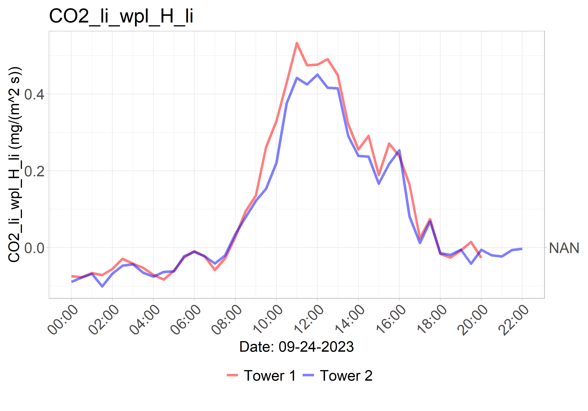
    </a>
  

  

    <h4>Flux Towers 1 & 2 - Today</h4>
    <a href="fluxtower1_2/daily_plots/fluxtower1_2_CO2_li_wpl_H_li_today.png" target="_blank">
      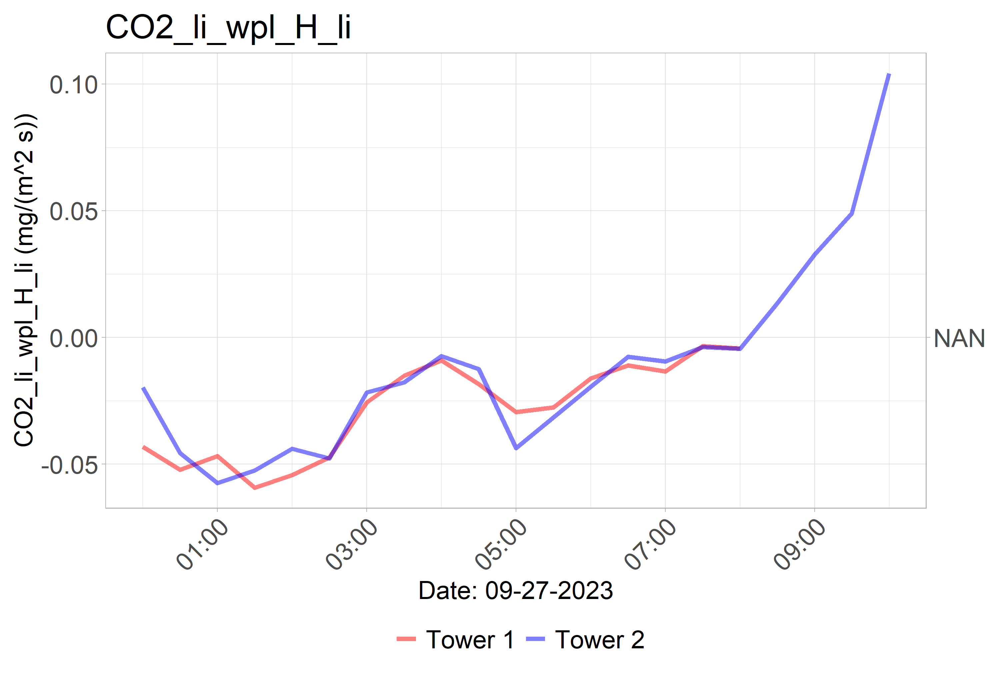
    </a>
  

  

  
  

  <!-- Fluxtower 3_4 Plots -->
  

    <h4>Flux Towers 3 & 4 - Yesterday</h4>
    <a href="fluxtower3_4/daily_plots/fluxtower3_4_CO2_li_wpl_H_li_yesterday.png" target="_blank">
      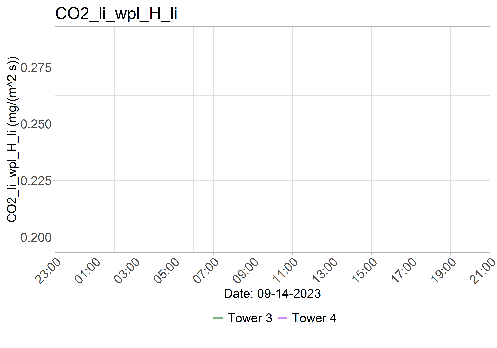
    </a>
  

  

    <h4>Flux Towers 3 & 4 - Today</h4>
    <a href="fluxtower3_4/daily_plots/fluxtower3_4_CO2_li_wpl_H_li_today.png" target="_blank">
      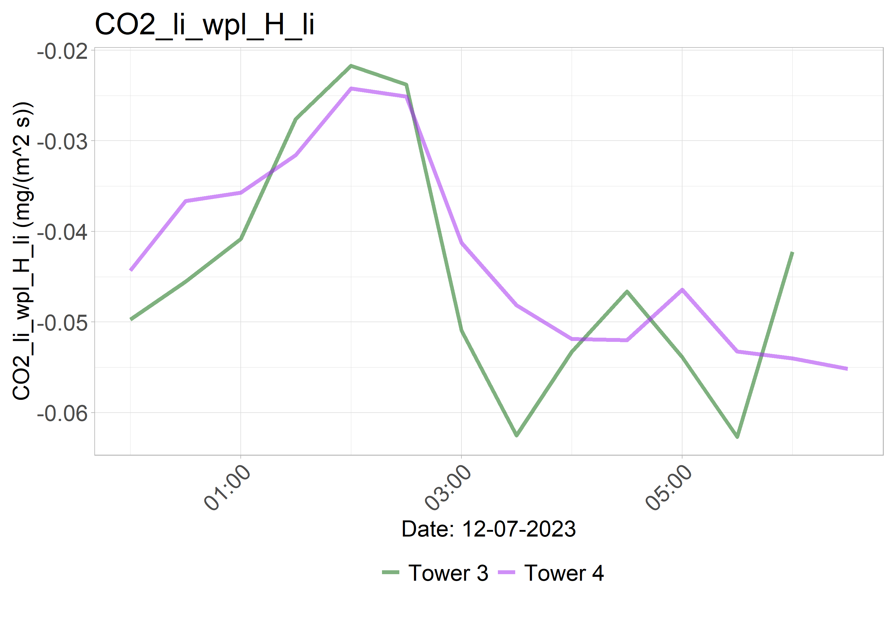
    </a>
  

<!-- end CO2_li_wpl_H_li: -->
            

 <!-- This is the closing tag for content div under Carbon Flux -->

 <!-- This is the closing tag for collapsibleContainer div under Carbon Flux -->
<!-- END Carbon Flux section: -->

<!-- Start Temperature section: -->

<button class="collapsible temperature">Temperature</button>

<!-- Start T_tmpr_rh_mean: -->
<h2>Air Temperature (T_tmpr_rh_mean)</h2>

  <!-- Fluxtower 1_2 Plots -->
  

    <h4>Flux Towers 1 & 2 - Yesterday</h4>
    <a href="fluxtower1_2/daily_plots/fluxtower1_2_T_tmpr_rh_mean_yesterday.png" target="_blank">
      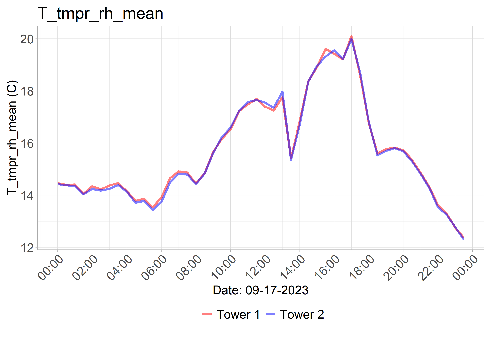
    </a>
  

  

    <h4>Flux Towers 1 & 2 - Today</h4>
    <a href="fluxtower1_2/daily_plots/fluxtower1_2_T_tmpr_rh_mean_today.png" target="_blank">
      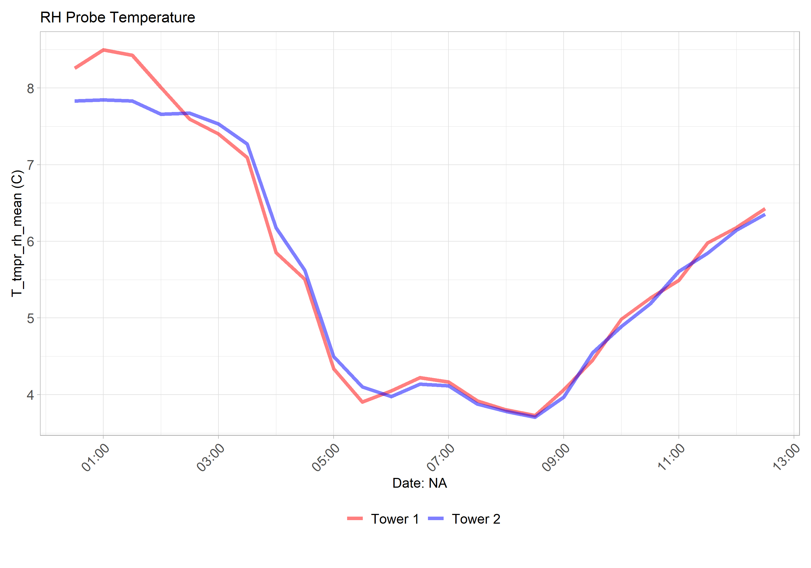
    </a>
  

  

  <!-- Fluxtower 3_4 Plots -->
  

    <h4>Flux Towers 3 & 4 - Yesterday</h4>
    <a href="fluxtower3_4/daily_plots/fluxtower3_4_T_tmpr_rh_mean_yesterday.png" target="_blank">
      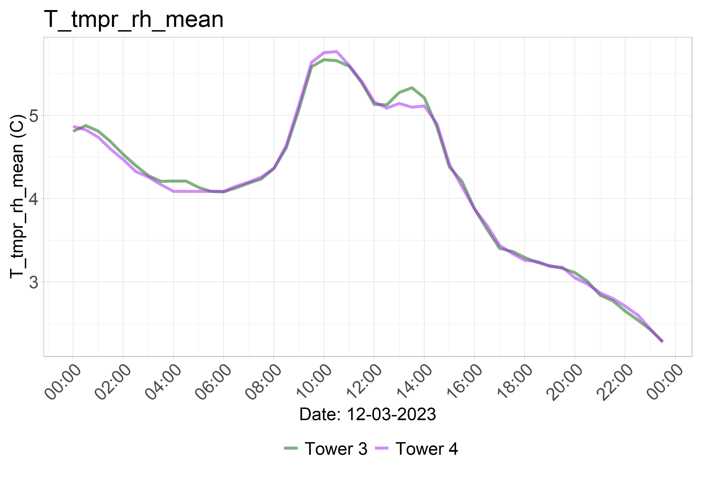
    </a>
  

  

    <h4>Flux Towers 3 & 4 - Today</h4>
    <a href="fluxtower3_4/daily_plots/fluxtower3_4_T_tmpr_rh_mean_today.png" target="_blank">
      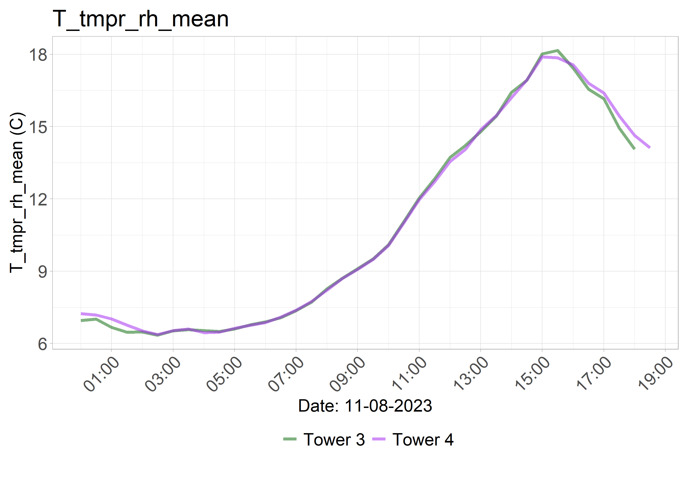
    </a>
  

<!-- end T_tmpr_rh_mean: -->
            
<!-- Start Ts_Avg: -->
<h2>Average Ts (Ts_Avg)</h2>

  <!-- Fluxtower 1_2 Plots -->
  

    <h4>Flux Towers 1 & 2 - Yesterday</h4>
    <a href="fluxtower1_2/daily_plots/fluxtower1_2_Ts_Avg_yesterday.png" target="_blank">
      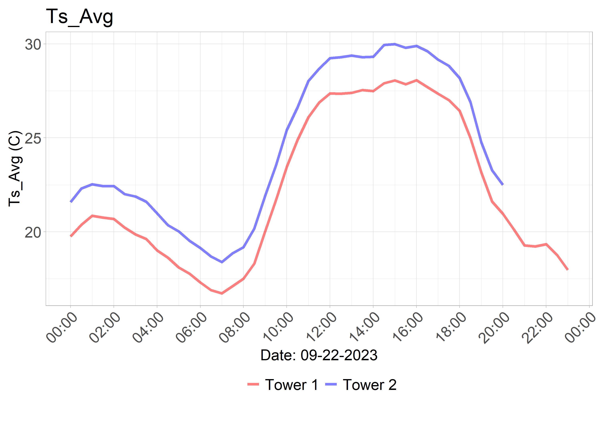
    </a>
  

  

    <h4>Flux Towers 1 & 2 - Today</h4>
    <a href="fluxtower1_2/daily_plots/fluxtower1_2_Ts_Avg_today.png" target="_blank">
      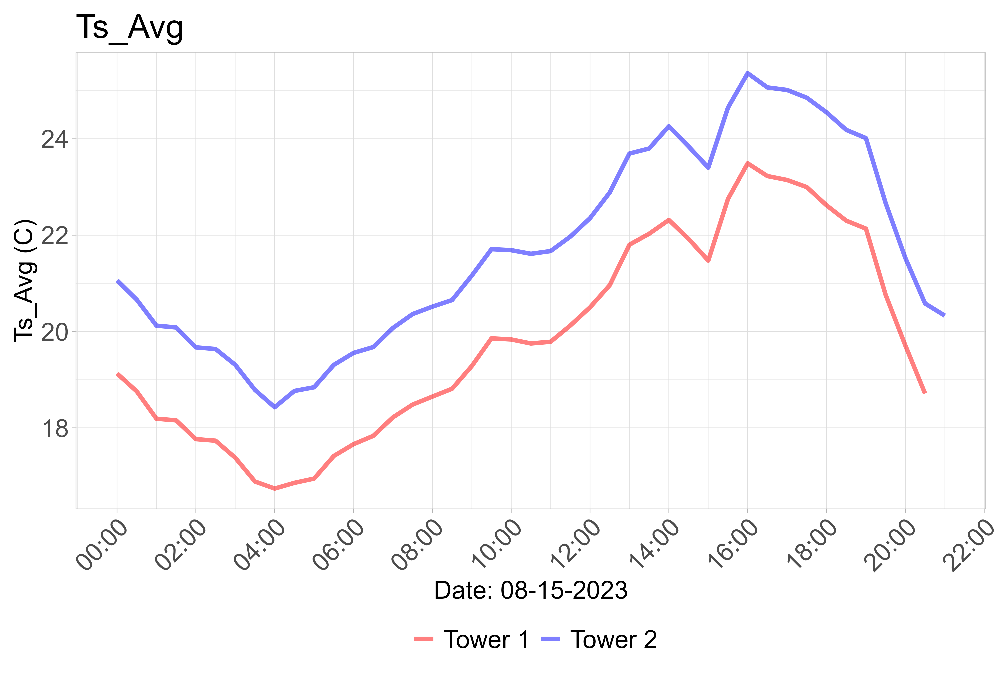
    </a>
  

  

  <!-- Fluxtower 3_4 Plots -->
  

    <h4>Flux Towers 3 & 4 - Yesterday</h4>
    <a href="fluxtower3_4/daily_plots/fluxtower3_4_Ts_Avg_yesterday.png" target="_blank">
      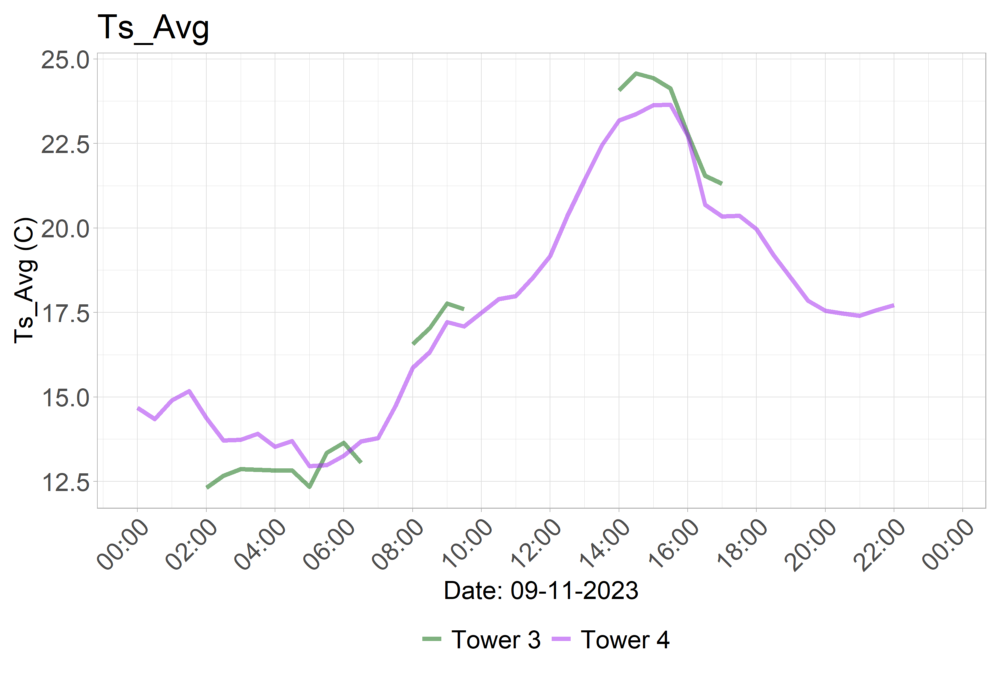
    </a>
  

  

    <h4>Flux Towers 3 & 4 - Today</h4>
    <a href="fluxtower3_4/daily_plots/fluxtower3_4_Ts_Avg_today.png" target="_blank">
      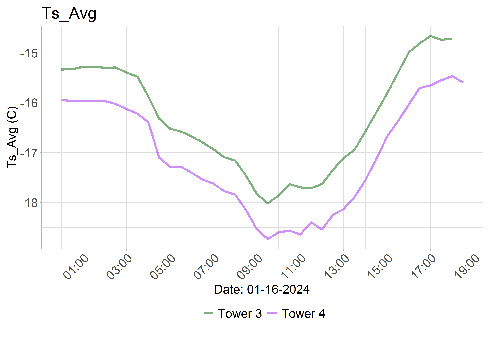
    </a>
  

<!-- end Ts_Avg: -->

 <!-- This is the closing tag for content div under Temperature -->

 <!-- This is the closing tag for collapsibleContainer div under Temperature -->
<!-- END Temperature section: -->

<!-- Start Relative Humidity section: -->

<button class="collapsible relativehum">Relative Humidity</button>

<!-- Start RH_tmpr_rh_mean: -->
<h2>Relative Humidity (RH_tmpr_rh_mean)</h2>

  <!-- Fluxtower 1_2 Plots -->
  

    <h4>Flux Towers 1 & 2 - Yesterday</h4>
    <a href="fluxtower1_2/daily_plots/fluxtower1_2_RH_tmpr_rh_mean_yesterday.png" target="_blank">
      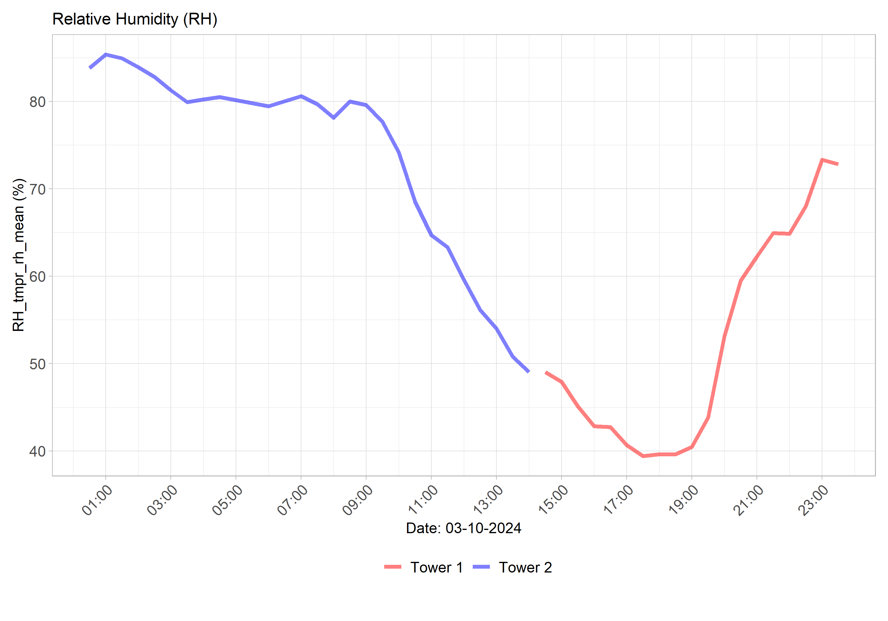
    </a>
  

  

    <h4>Flux Towers 1 & 2 - Today</h4>
    <a href="fluxtower1_2/daily_plots/fluxtower1_2_RH_tmpr_rh_mean_today.png" target="_blank">
      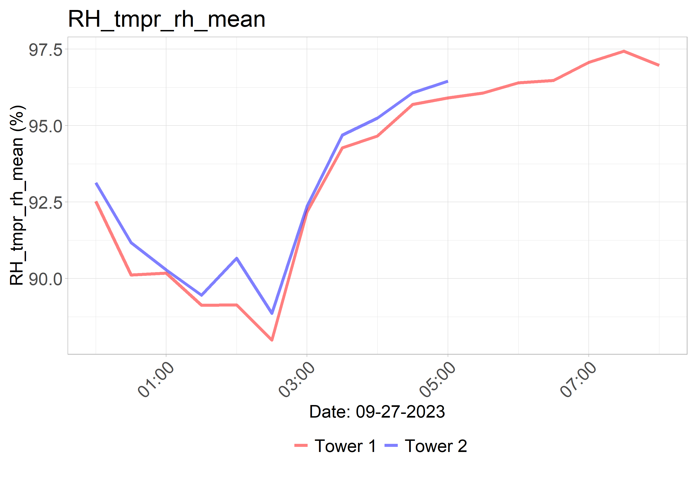
    </a>
  

  

  <!-- Fluxtower 3_4 Plots -->
  

    <h4>Flux Towers 3 & 4 - Yesterday</h4>
    <a href="fluxtower3_4/daily_plots/fluxtower3_4_RH_tmpr_rh_mean_yesterday.png" target="_blank">
      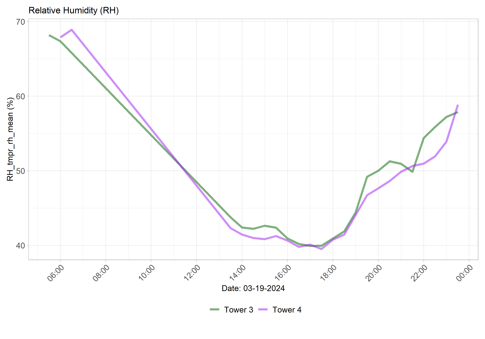
    </a>
  

  

    <h4>Flux Towers 3 & 4 - Today</h4>
    <a href="fluxtower3_4/daily_plots/fluxtower3_4_RH_tmpr_rh_mean_today.png" target="_blank">
      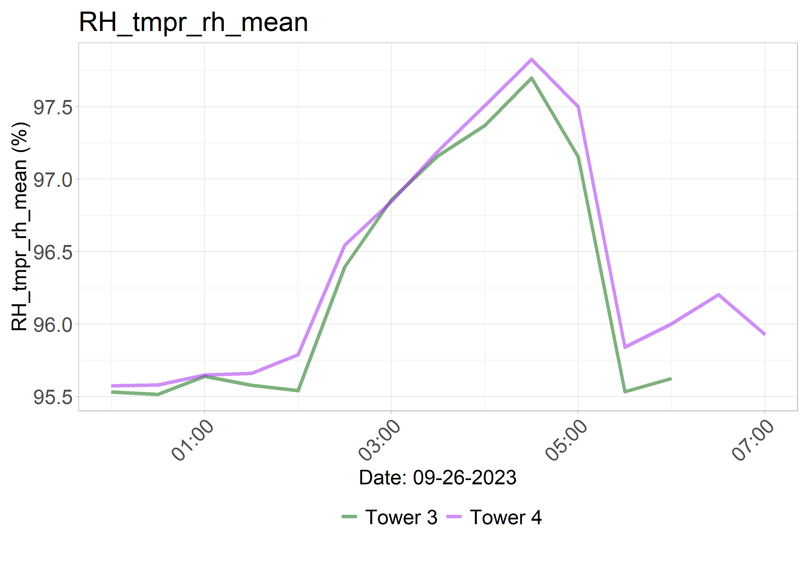
    </a>
  

<!-- end RH_tmpr_rh_mean: -->
            

 <!-- This is the closing tag for content div under Relative Humidity -->

 <!-- This is the closing tag for collapsibleContainer div under Relative Humidity -->
<!-- END Relative Humidity section: -->

<!-- Start Precipitation section: -->

<button class="collapsible precip">Precipitation</button>

<!-- Start precip_Tot: -->
<h2>Precipitation (precip_Tot)</h2>

  <!-- Fluxtower 1_2 Plots -->
  

    <h4>Flux Towers 1 & 2 - Yesterday</h4>
    <a href="fluxtower1_2/daily_plots/fluxtower1_2_precip_Tot_yesterday.png" target="_blank">
      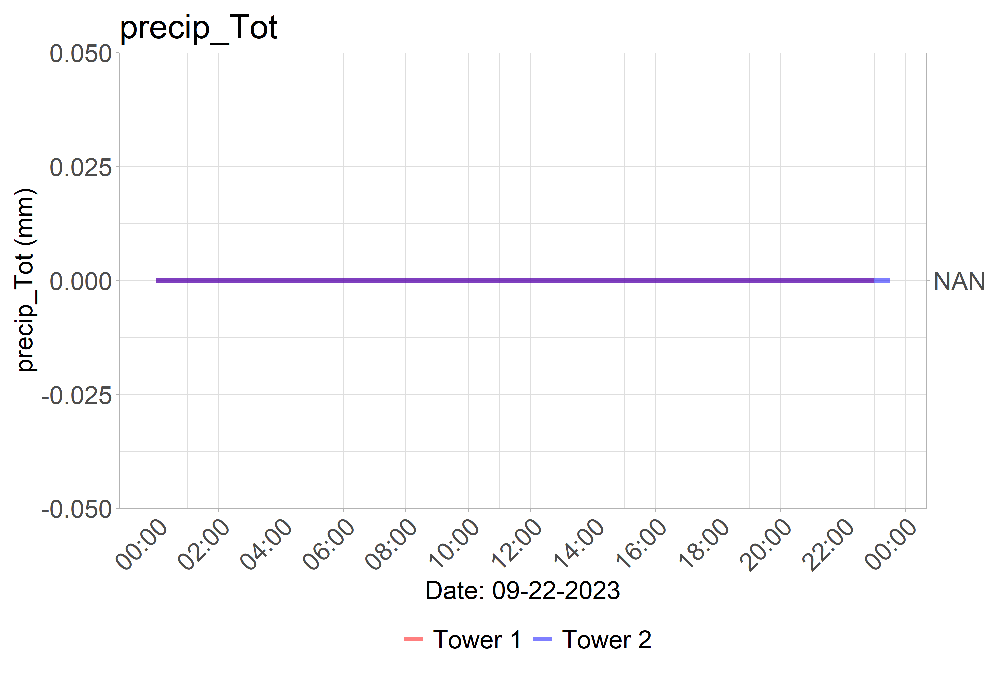
    </a>
  

  

    <h4>Flux Towers 1 & 2 - Today</h4>
    <a href="fluxtower1_2/daily_plots/fluxtower1_2_precip_Tot_today.png" target="_blank">
      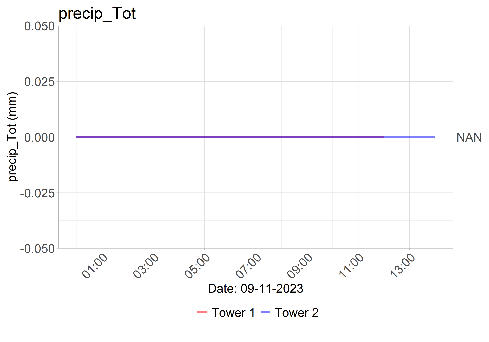
    </a>
  

  

  <!-- Fluxtower 3_4 Plots -->
  

    <h4>Flux Towers 3 & 4 - Yesterday</h4>
    <a href="fluxtower3_4/daily_plots/fluxtower3_4_precip_Tot_yesterday.png" target="_blank">
      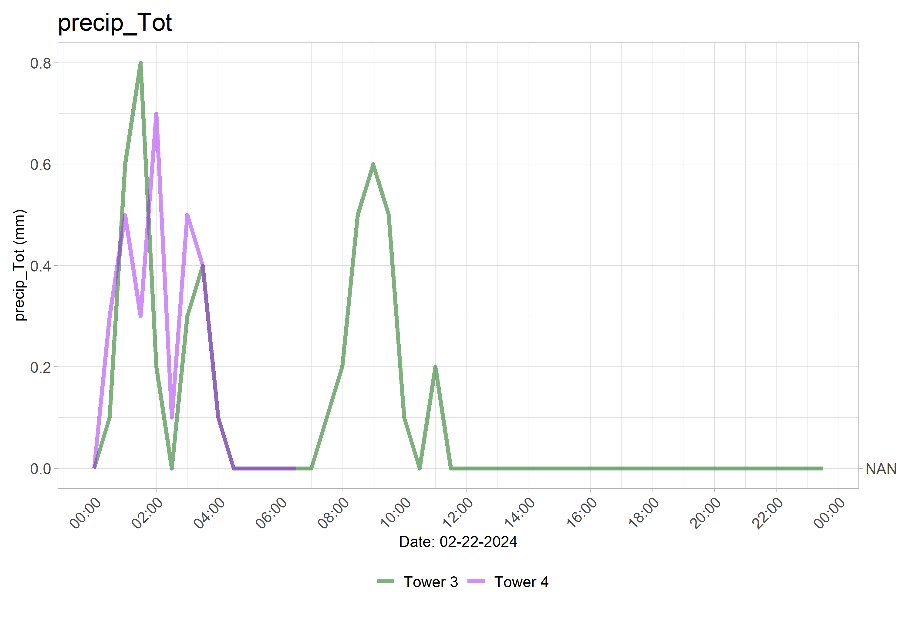
    </a>
  

  

    <h4>Flux Towers 3 & 4 - Today</h4>
    <a href="fluxtower3_4/daily_plots/fluxtower3_4_precip_Tot_today.png" target="_blank">
      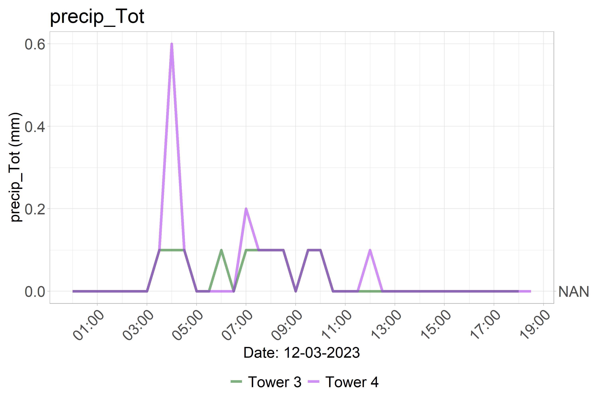
    </a>
  

<!-- end precip_Tot: -->
            

 <!-- This is the closing tag for content div under Precipitation -->

 <!-- This is the closing tag for collapsibleContainer div under Precipitation -->
<!-- END Precipitation section: -->
 
 
 
<!-- Start Net Radiation section: -->

<button class="collapsible radiation">Net Radiation</button>

<!-- Start albedo_Avg: -->
<h2>Average Albedo (albedo_Avg)</h2>

  <!-- Fluxtower 1_2 Plots -->
  

    <h4>Flux Towers 1 & 2 - Yesterday</h4>
    <a href="fluxtower1_2/daily_plots/fluxtower1_2_albedo_Avg_yesterday.png" target="_blank">
      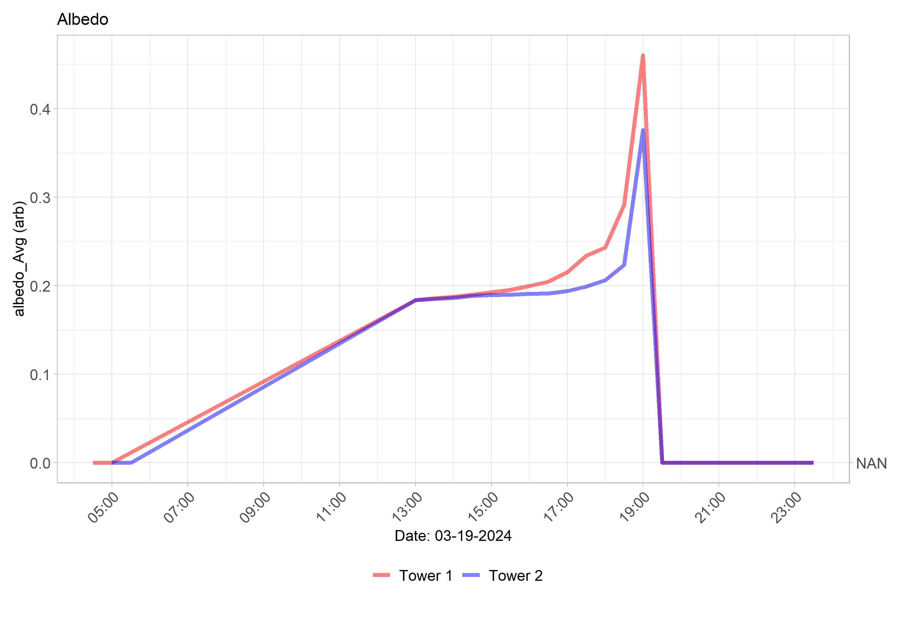
    </a>
  

  

    <h4>Flux Towers 1 & 2 - Today</h4>
    <a href="fluxtower1_2/daily_plots/fluxtower1_2_albedo_Avg_today.png" target="_blank">
      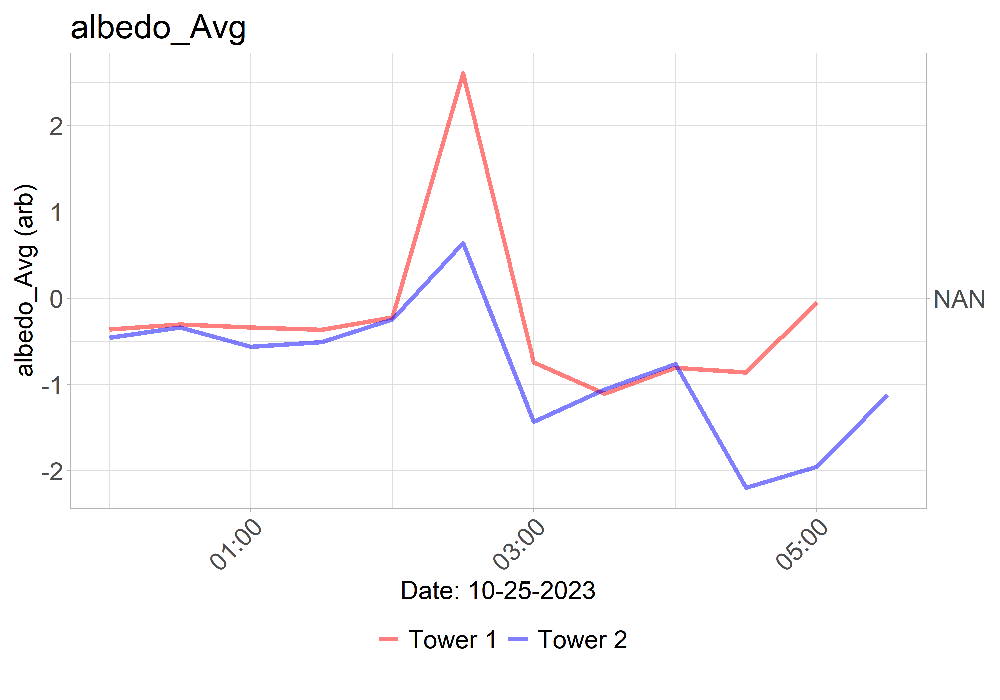
    </a>
  

  

  <!-- Fluxtower 3_4 Plots -->
  

    <h4>Flux Towers 3 & 4 - Yesterday</h4>
    <a href="fluxtower3_4/daily_plots/fluxtower3_4_albedo_Avg_yesterday.png" target="_blank">
      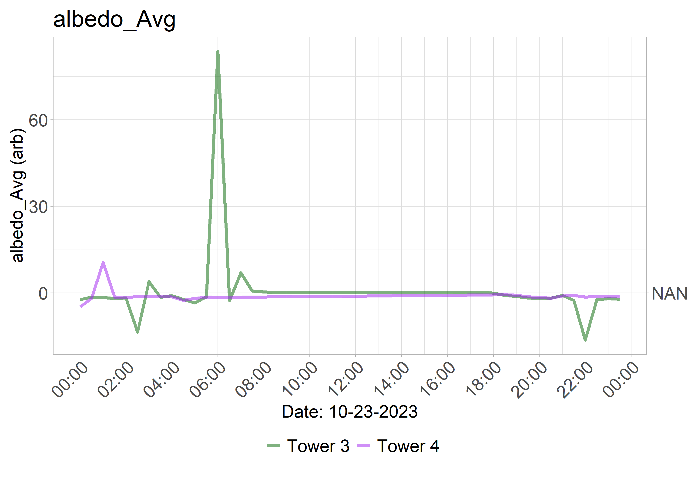
    </a>
  

  

    <h4>Flux Towers 3 & 4 - Today</h4>
    <a href="fluxtower3_4/daily_plots/fluxtower3_4_albedo_Avg_today.png" target="_blank">
      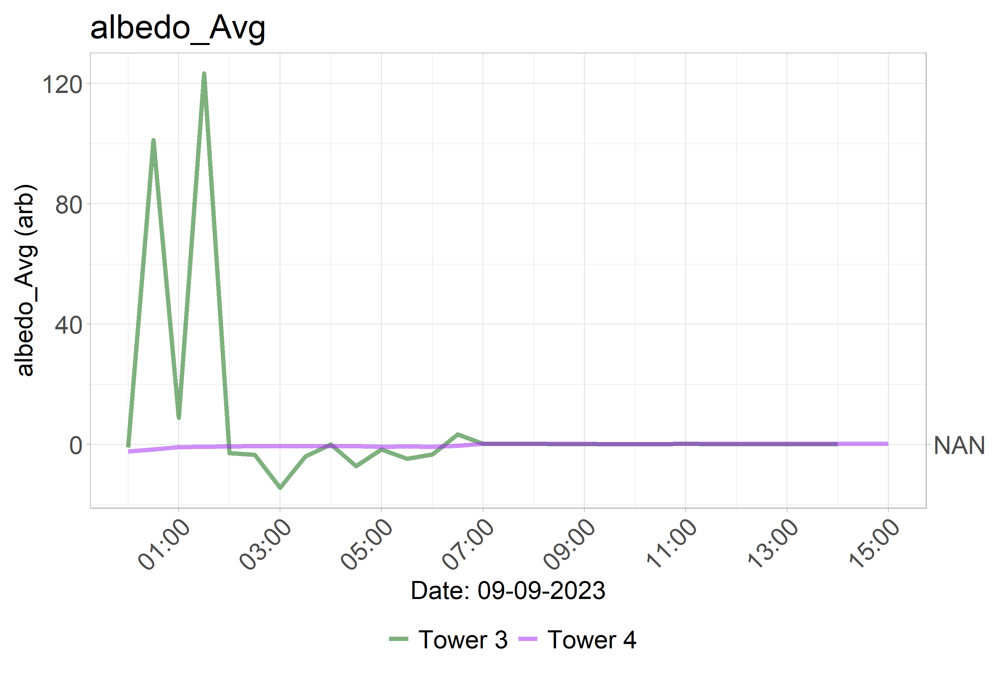
    </a>
  

<!-- end albedo_Avg: -->

<!-- Start Rn_Avg: -->
<h2>Average Net Radiation (Rn_Avg)</h2>

  <!-- Fluxtower 1_2 Plots -->
  

    <h4>Flux Towers 1 & 2 - Yesterday</h4>
    <a href="fluxtower1_2/daily_plots/fluxtower1_2_Rn_Avg_yesterday.png" target="_blank">
      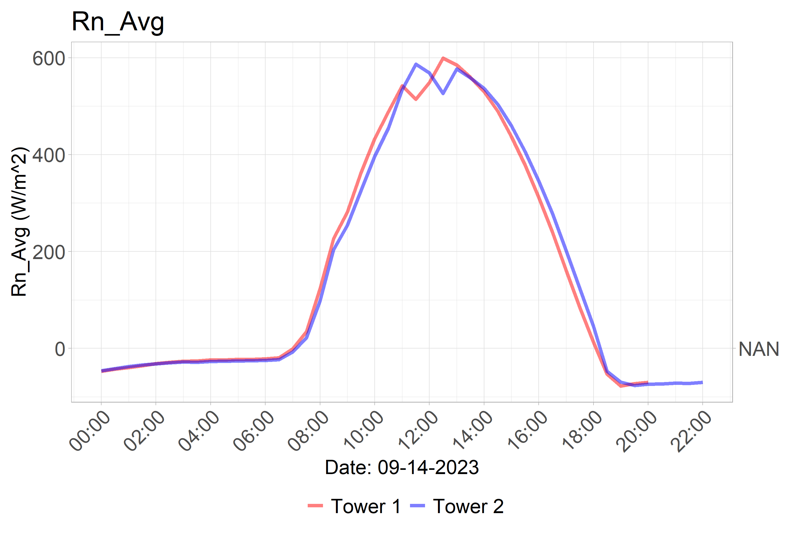
    </a>
  

  

    <h4>Flux Towers 1 & 2 - Today</h4>
    <a href="fluxtower1_2/daily_plots/fluxtower1_2_Rn_Avg_today.png" target="_blank">
      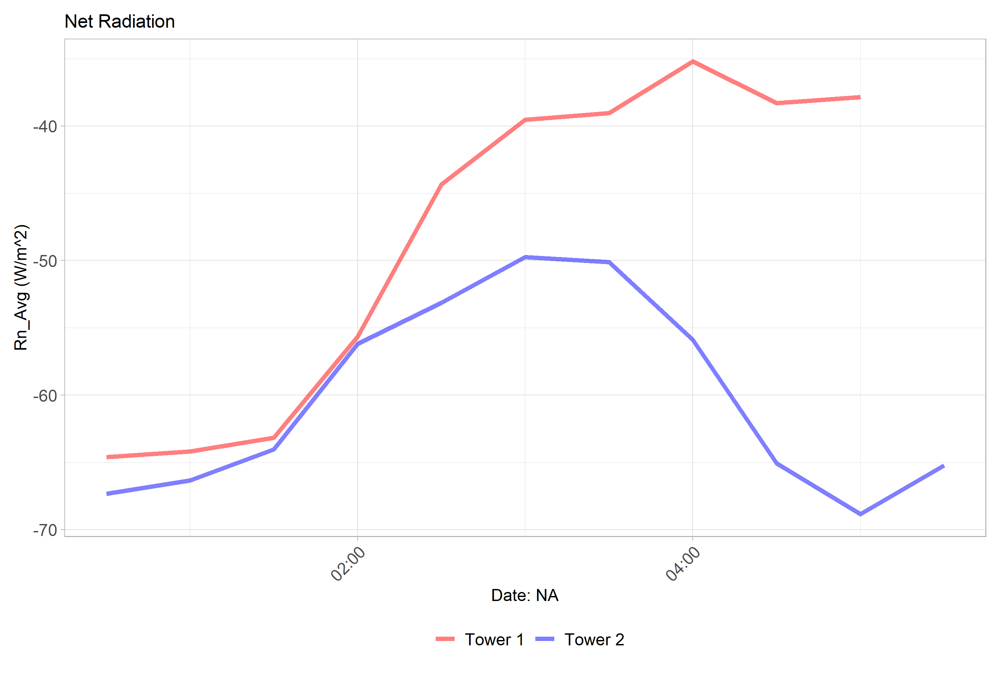
    </a>
  

  

  <!-- Fluxtower 3_4 Plots -->
  

    <h4>Flux Towers 3 & 4 - Yesterday</h4>
    <a href="fluxtower3_4/daily_plots/fluxtower3_4_Rn_Avg_yesterday.png" target="_blank">
      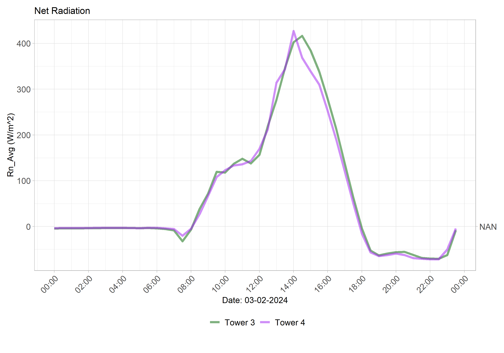
    </a>
  

  

    <h4>Flux Towers 3 & 4 - Today</h4>
    <a href="fluxtower3_4/daily_plots/fluxtower3_4_Rn_Avg_today.png" target="_blank">
      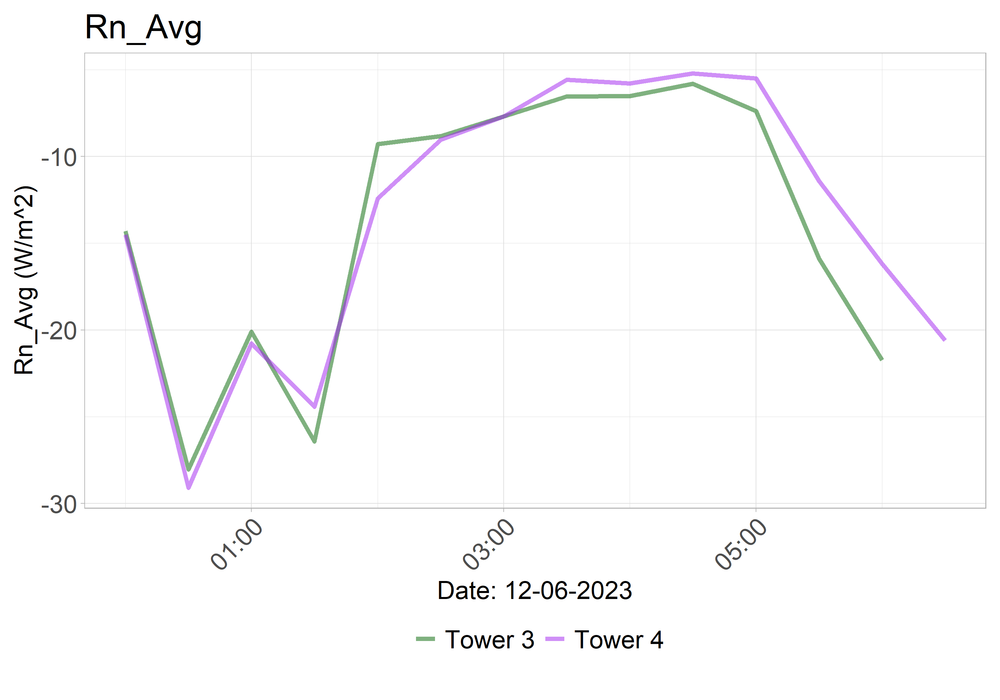
    </a>
  

<!-- end Rn_Avg: -->

<!-- Start par_Avg: -->
<h2>Average PAR (par_Avg)</h2>

  <!-- Fluxtower 1_2 Plots -->
  

    <h4>Flux Towers 1 & 2 - Yesterday</h4>
    <a href="fluxtower1_2/daily_plots/fluxtower1_2_par_Avg_yesterday.png" target="_blank">
      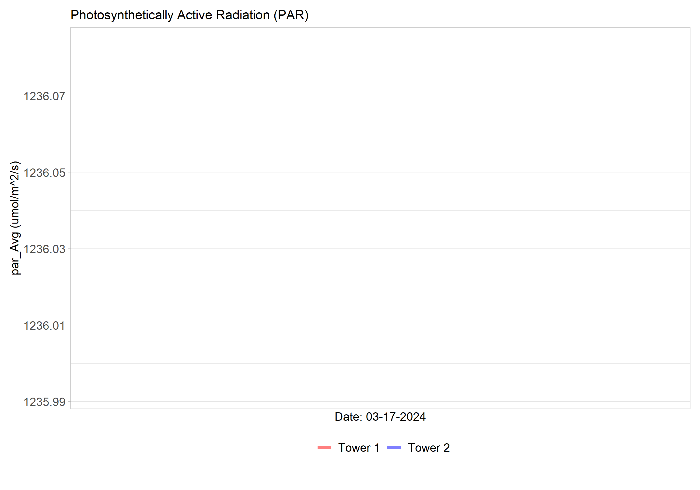
    </a>
  

  

    <h4>Flux Towers 1 & 2 - Today</h4>
    <a href="fluxtower1_2/daily_plots/fluxtower1_2_par_Avg_today.png" target="_blank">
      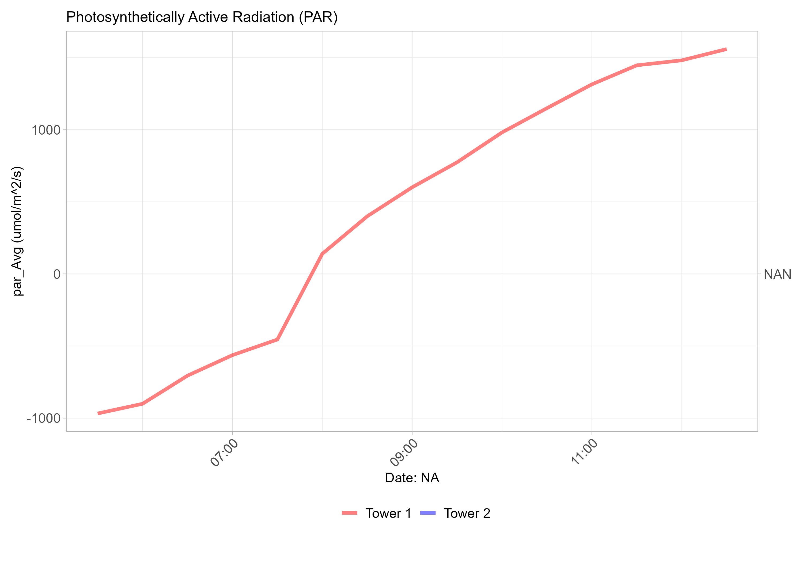
    </a>
  

  

  <!-- Fluxtower 3_4 Plots -->
  

    <h4>Flux Towers 3 & 4 - Yesterday</h4>
    <a href="fluxtower3_4/daily_plots/fluxtower3_4_par_Avg_yesterday.png" target="_blank">
      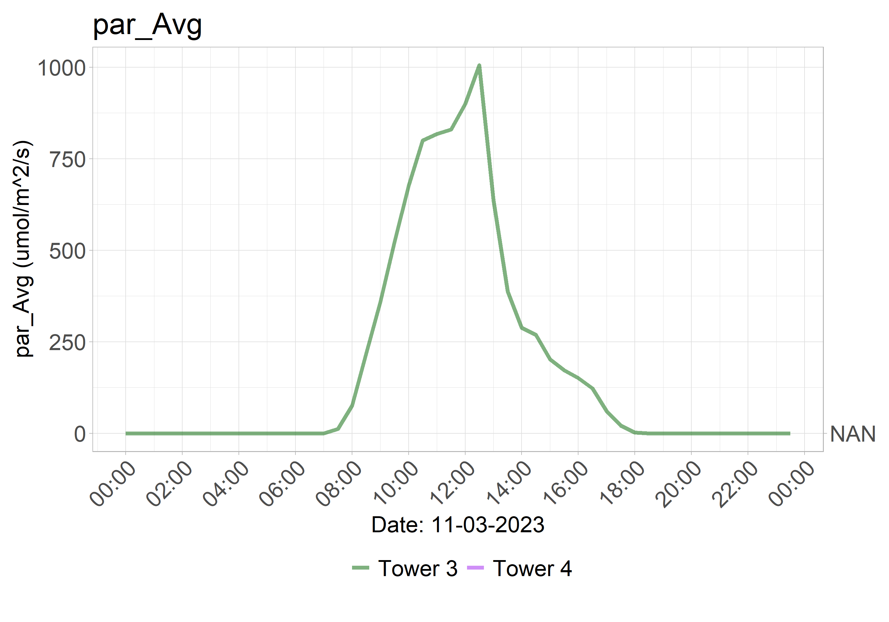
    </a>
  

  

    <h4>Flux Towers 3 & 4 - Today</h4>
    <a href="fluxtower3_4/daily_plots/fluxtower3_4_par_Avg_today.png" target="_blank">
      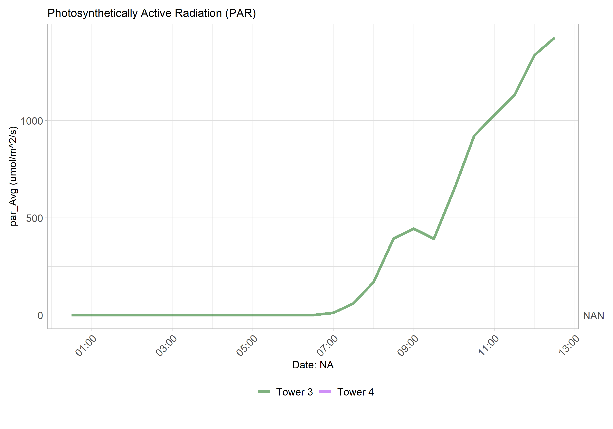
    </a>
  

<!-- end par_Avg: -->

<!-- Start Rl_incoming_Avg: -->
<h2>Average Incoming Rl (Rl_incoming_Avg)</h2>

  <!-- Fluxtower 1_2 Plots -->
  

    <h4>Flux Towers 1 & 2 - Yesterday</h4>
    <a href="fluxtower1_2/daily_plots/fluxtower1_2_Rl_incoming_Avg_yesterday.png" target="_blank">
      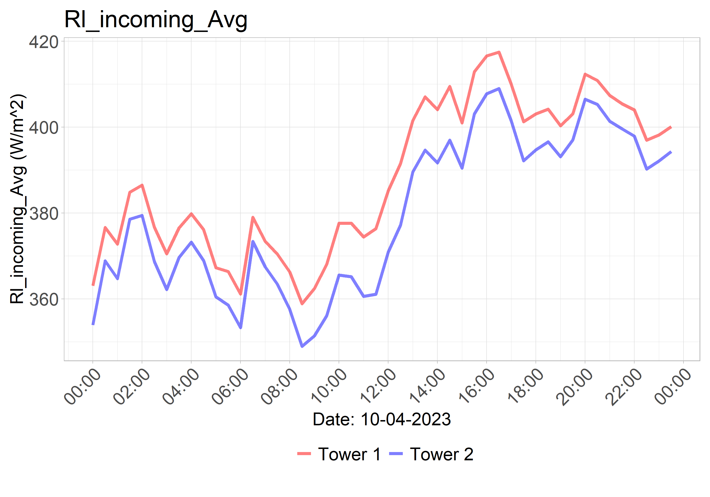
    </a>
  

  

    <h4>Flux Towers 1 & 2 - Today</h4>
    <a href="fluxtower1_2/daily_plots/fluxtower1_2_Rl_incoming_Avg_today.png" target="_blank">
      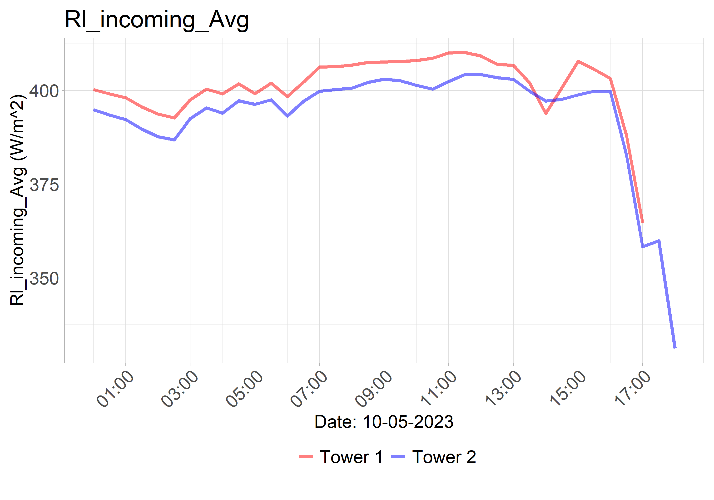
    </a>
  

  

  <!-- Fluxtower 3_4 Plots -->
  

    <h4>Flux Towers 3 & 4 - Yesterday</h4>
    <a href="fluxtower3_4/daily_plots/fluxtower3_4_Rl_incoming_Avg_yesterday.png" target="_blank">
      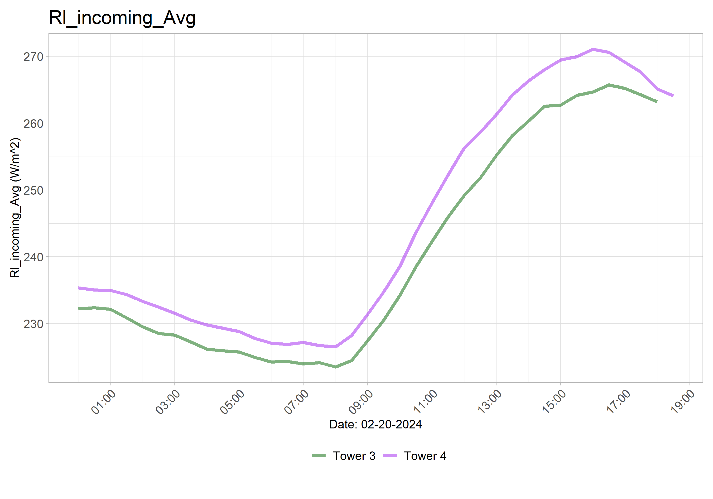
    </a>
  

  

    <h4>Flux Towers 3 & 4 - Today</h4>
    <a href="fluxtower3_4/daily_plots/fluxtower3_4_Rl_incoming_Avg_today.png" target="_blank">
      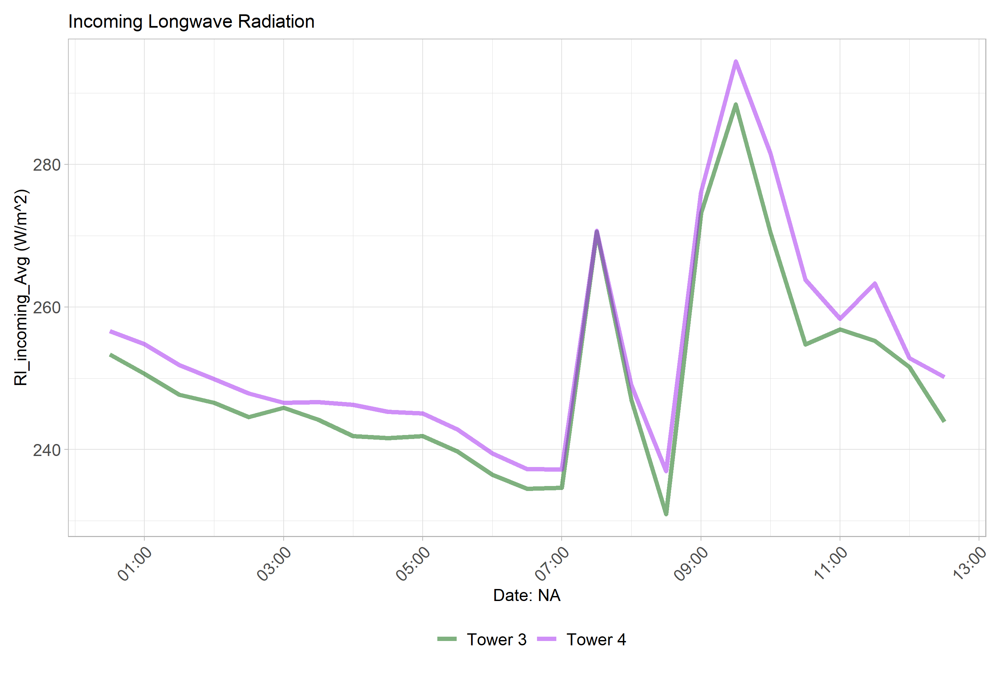
    </a>
  

<!-- end Rl_incoming_Avg: -->
            

<!-- Start Rl_outgoing_Avg: -->
<h2>Average Outgoing Rl (Rl_outgoing_Avg)</h2>

  <!-- Fluxtower 1_2 Plots -->
  

    <h4>Flux Towers 1 & 2 - Yesterday</h4>
    <a href="fluxtower1_2/daily_plots/fluxtower1_2_Rl_outgoing_Avg_yesterday.png" target="_blank">
      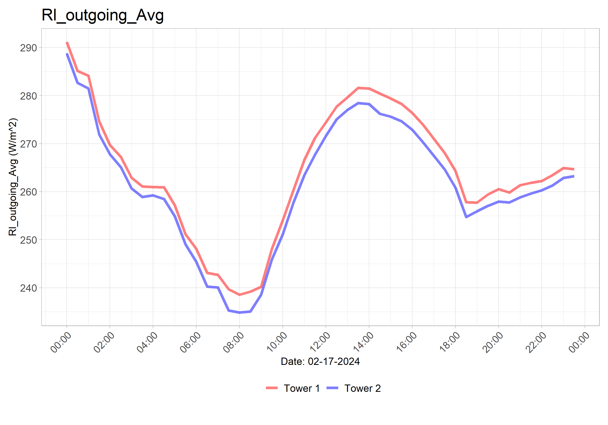
    </a>
  

  

    <h4>Flux Towers 1 & 2 - Today</h4>
    <a href="fluxtower1_2/daily_plots/fluxtower1_2_Rl_outgoing_Avg_today.png" target="_blank">
      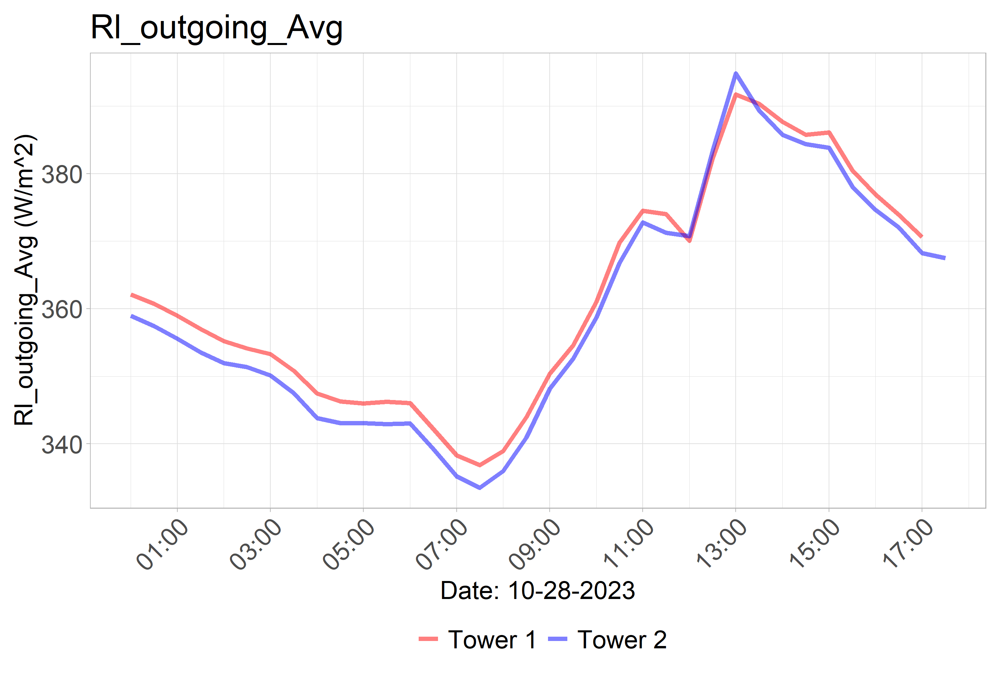
    </a>
  

  

  <!-- Fluxtower 3_4 Plots -->
  

    <h4>Flux Towers 3 & 4 - Yesterday</h4>
    <a href="fluxtower3_4/daily_plots/fluxtower3_4_Rl_outgoing_Avg_yesterday.png" target="_blank">
      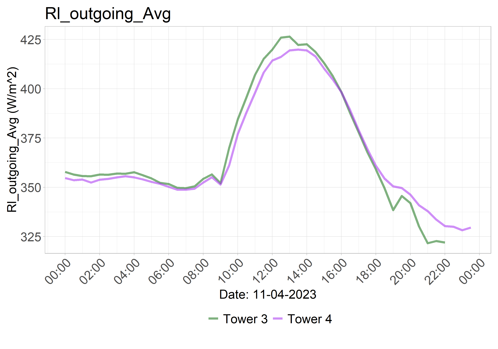
    </a>
  

  

    <h4>Flux Towers 3 & 4 - Today</h4>
    <a href="fluxtower3_4/daily_plots/fluxtower3_4_Rl_outgoing_Avg_today.png" target="_blank">
      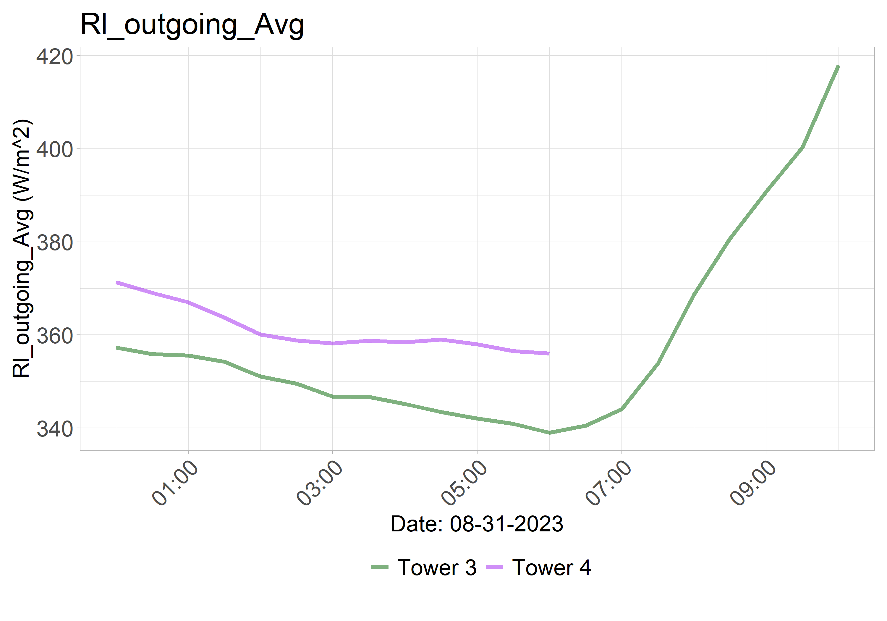
    </a>
  

<!-- end Rl_outgoing_Avg: -->

<!-- Start Rs_incoming_Avg: -->
<h2>Average Incoming Rs (Rs_incoming_Avg)</h2>

  <!-- Fluxtower 1_2 Plots -->
  

    <h4>Flux Towers 1 & 2 - Yesterday</h4>
    <a href="fluxtower1_2/daily_plots/fluxtower1_2_Rs_incoming_Avg_yesterday.png" target="_blank">
      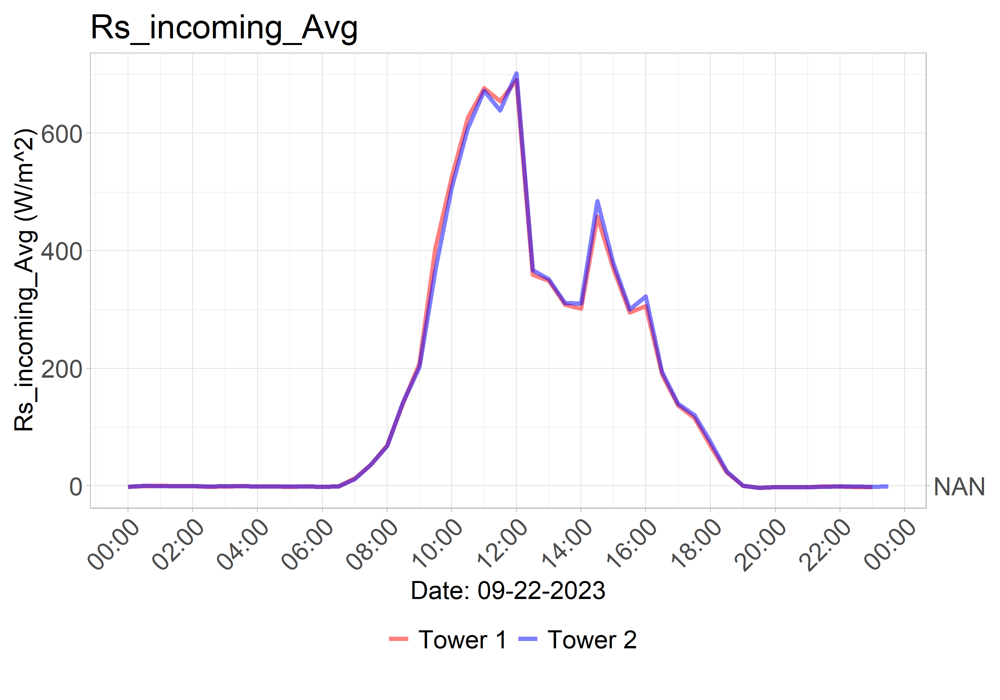
    </a>
  

  

    <h4>Flux Towers 1 & 2 - Today</h4>
    <a href="fluxtower1_2/daily_plots/fluxtower1_2_Rs_incoming_Avg_today.png" target="_blank">
      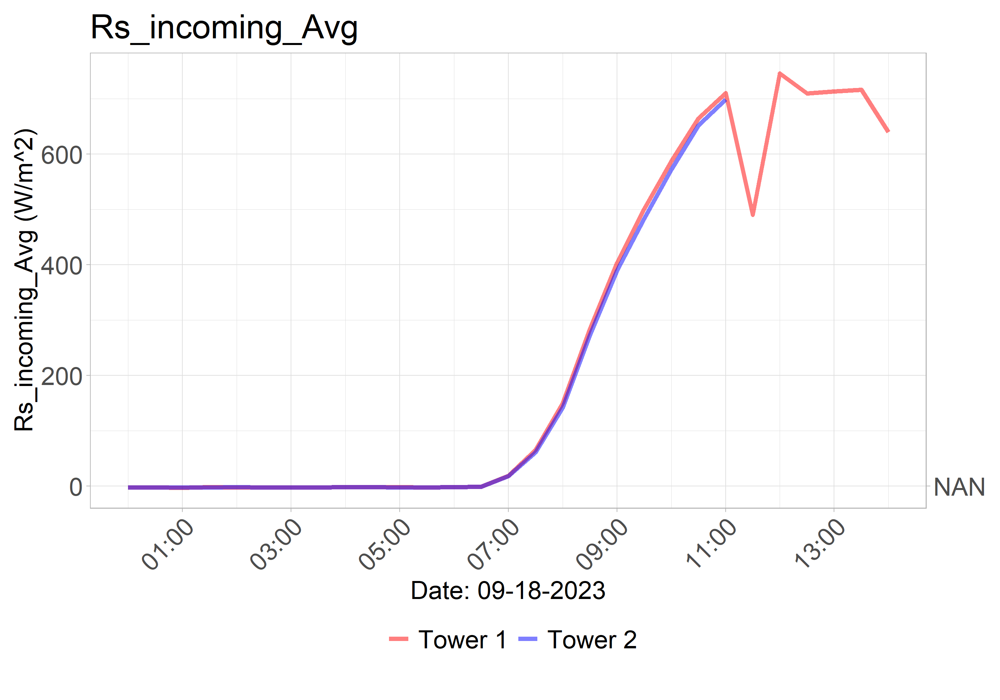
    </a>
  

  

  <!-- Fluxtower 3_4 Plots -->
  

    <h4>Flux Towers 3 & 4 - Yesterday</h4>
    <a href="fluxtower3_4/daily_plots/fluxtower3_4_Rs_incoming_Avg_yesterday.png" target="_blank">
      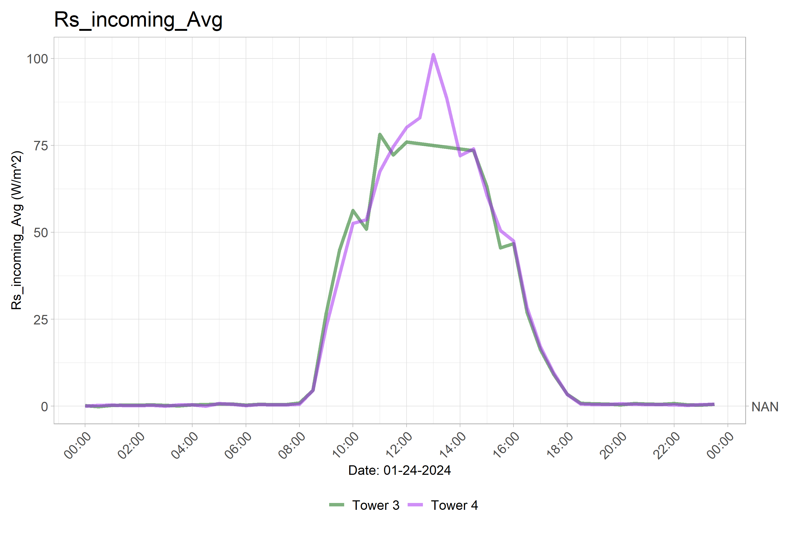
    </a>
  

  

    <h4>Flux Towers 3 & 4 - Today</h4>
    <a href="fluxtower3_4/daily_plots/fluxtower3_4_Rs_incoming_Avg_today.png" target="_blank">
      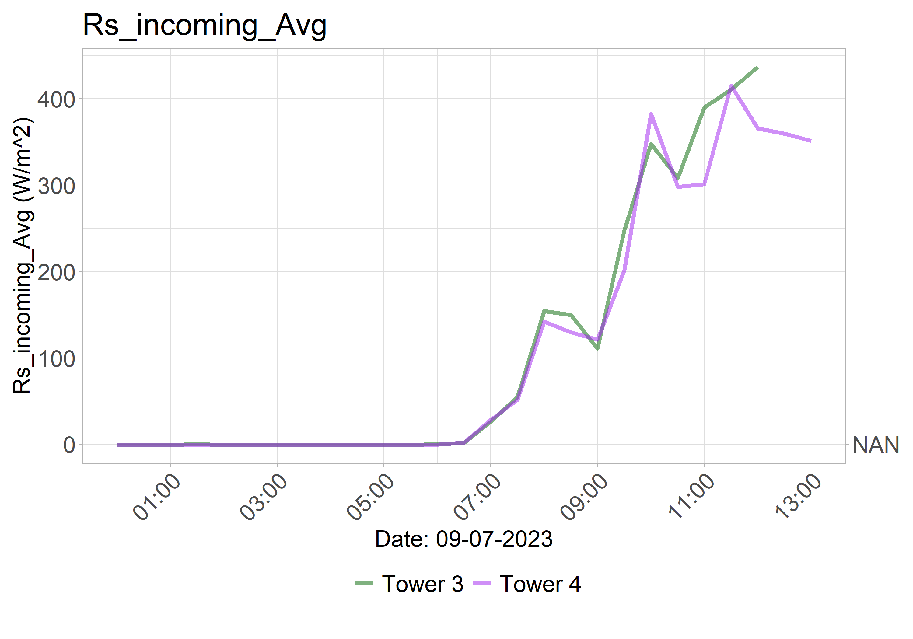
    </a>
  

<!-- end Rs_incoming_Avg: -->

<!-- Start Rs_outgoing_Avg: -->
<h2>Average Outgoing Rs (Rs_outgoing_Avg)</h2>

  <!-- Fluxtower 1_2 Plots -->
  

    <h4>Flux Towers 1 & 2 - Yesterday</h4>
    <a href="fluxtower1_2/daily_plots/fluxtower1_2_Rs_outgoing_Avg_yesterday.png" target="_blank">
      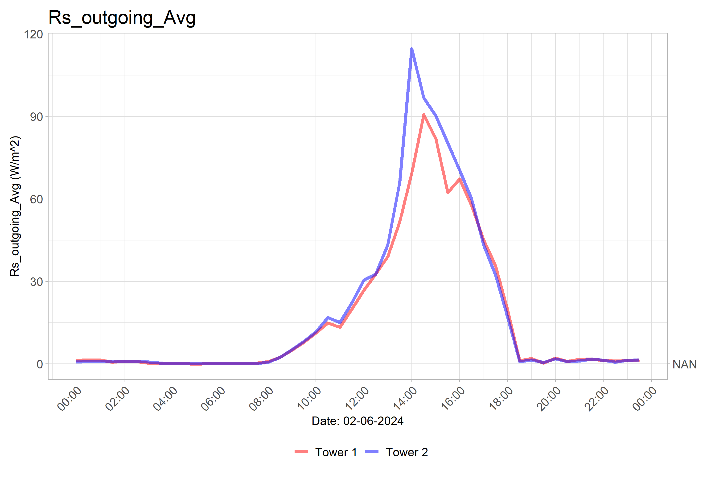
    </a>
  

  

    <h4>Flux Towers 1 & 2 - Today</h4>
    <a href="fluxtower1_2/daily_plots/fluxtower1_2_Rs_outgoing_Avg_today.png" target="_blank">
      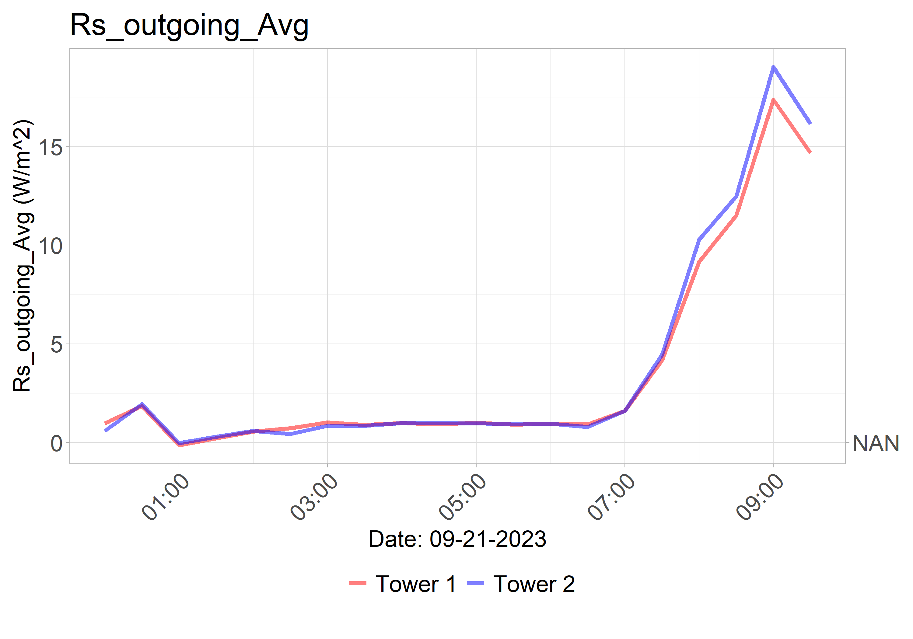
    </a>
  

  

  <!-- Fluxtower 3_4 Plots -->
  

    <h4>Flux Towers 3 & 4 - Yesterday</h4>
    <a href="fluxtower3_4/daily_plots/fluxtower3_4_Rs_outgoing_Avg_yesterday.png" target="_blank">
      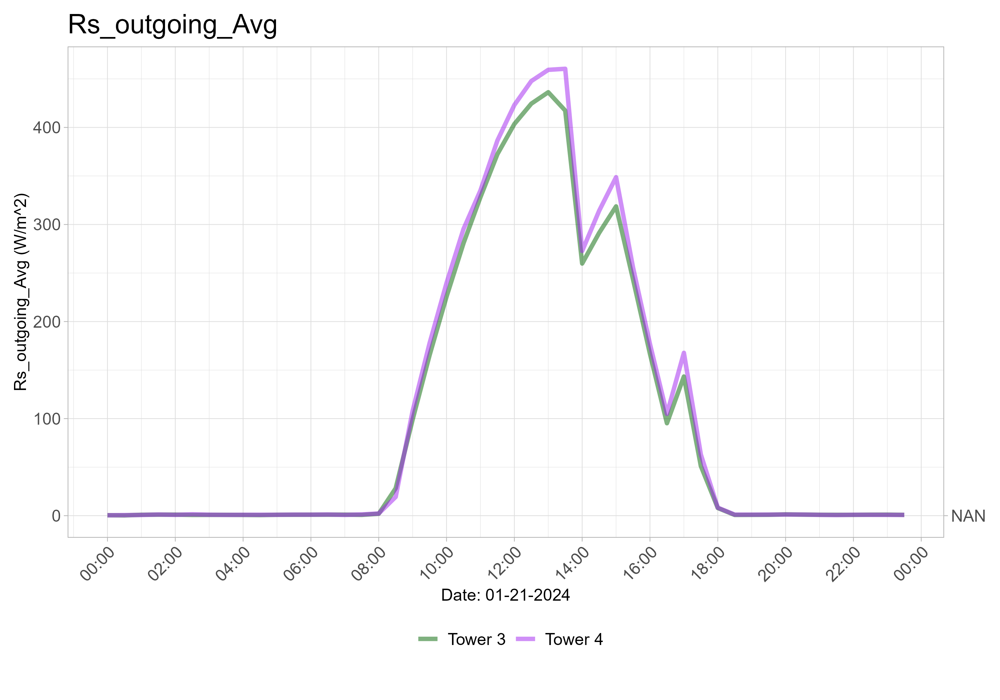
    </a>
  

  

    <h4>Flux Towers 3 & 4 - Today</h4>
    <a href="fluxtower3_4/daily_plots/fluxtower3_4_Rs_outgoing_Avg_today.png" target="_blank">
      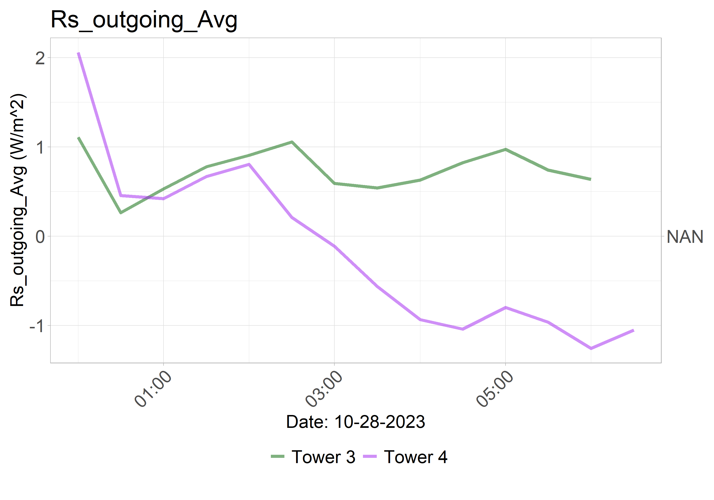
    </a>
  

<!-- end Rs_outgoing_Avg: -->
            
            

 <!-- This is the closing tag for content div under Net Radiation -->

 <!-- This is the closing tag for collapsibleContainer div under Net Radiation -->
<!-- END Net Radiation section: -->

<!-- Start Latent Heat Flux section: -->

<button class="collapsible latent">Latent Heat Flux</button>

<!-- Start LE_li_irga: -->
<h2>Latent Heat Flux (LE_li_irga)</h2>

  <!-- Fluxtower 1_2 Plots -->
  

    <h4>Flux Towers 1 & 2 - Yesterday</h4>
    <a href="fluxtower1_2/daily_plots/fluxtower1_2_LE_li_irga_yesterday.png" target="_blank">
      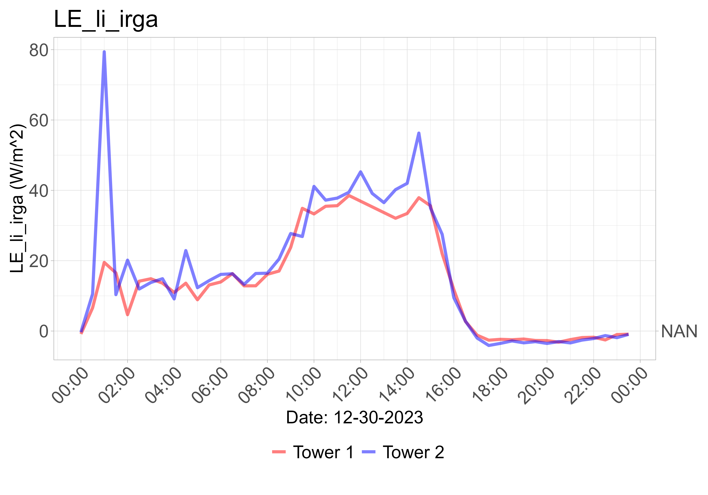
    </a>
  

  

    <h4>Flux Towers 1 & 2 - Today</h4>
    <a href="fluxtower1_2/daily_plots/fluxtower1_2_LE_li_irga_today.png" target="_blank">
      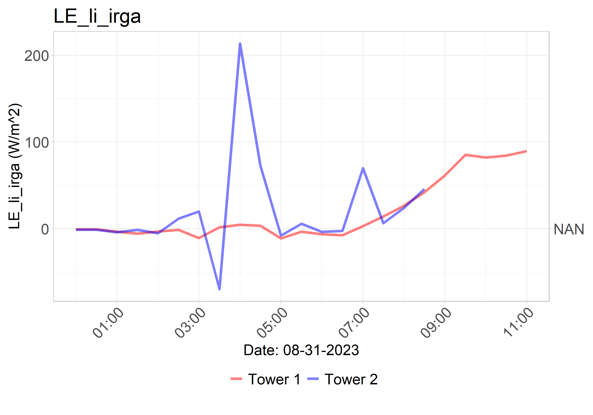
    </a>
  

  

  <!-- Fluxtower 3_4 Plots -->
  

    <h4>Flux Towers 3 & 4 - Yesterday</h4>
    <a href="fluxtower3_4/daily_plots/fluxtower3_4_LE_li_irga_yesterday.png" target="_blank">
      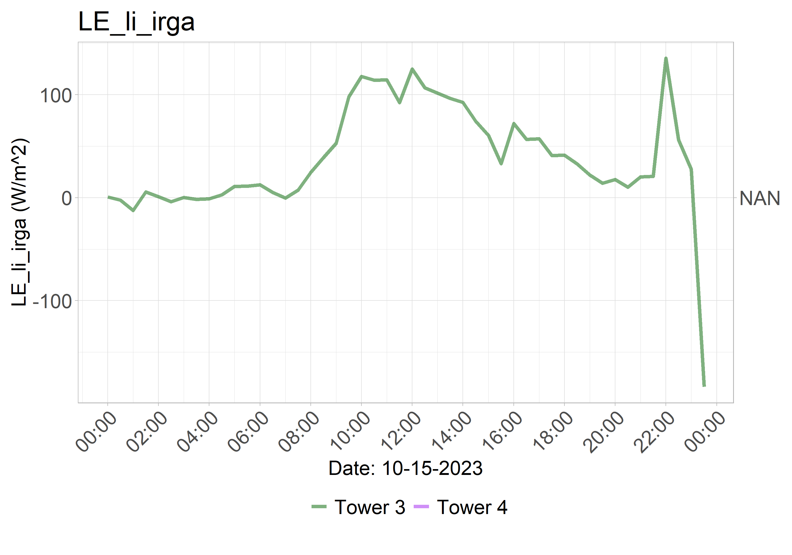
    </a>
  

  

    <h4>Flux Towers 3 & 4 - Today</h4>
    <a href="fluxtower3_4/daily_plots/fluxtower3_4_LE_li_irga_today.png" target="_blank">
      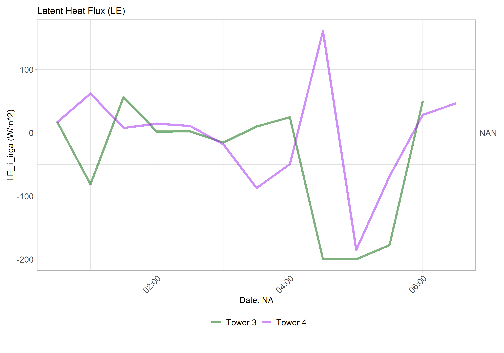
    </a>
  

<!-- end LE_li_irga: -->

<!-- Start LE_li_wpl: -->
<h2>Latent Heat Flux (LE_li_wpl)</h2>

  <!-- Fluxtower 1_2 Plots -->
  

    <h4>Flux Towers 1 & 2 - Yesterday</h4>
    <a href="fluxtower1_2/daily_plots/fluxtower1_2_LE_li_wpl_yesterday.png" target="_blank">
      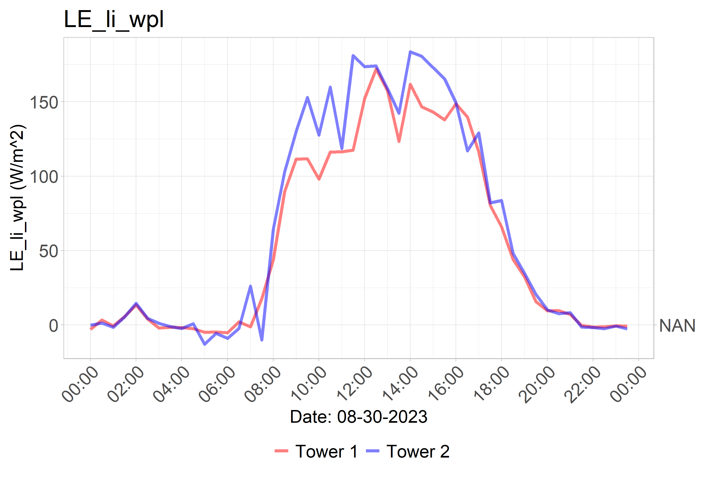
    </a>
  

  

    <h4>Flux Towers 1 & 2 - Today</h4>
    <a href="fluxtower1_2/daily_plots/fluxtower1_2_LE_li_wpl_today.png" target="_blank">
      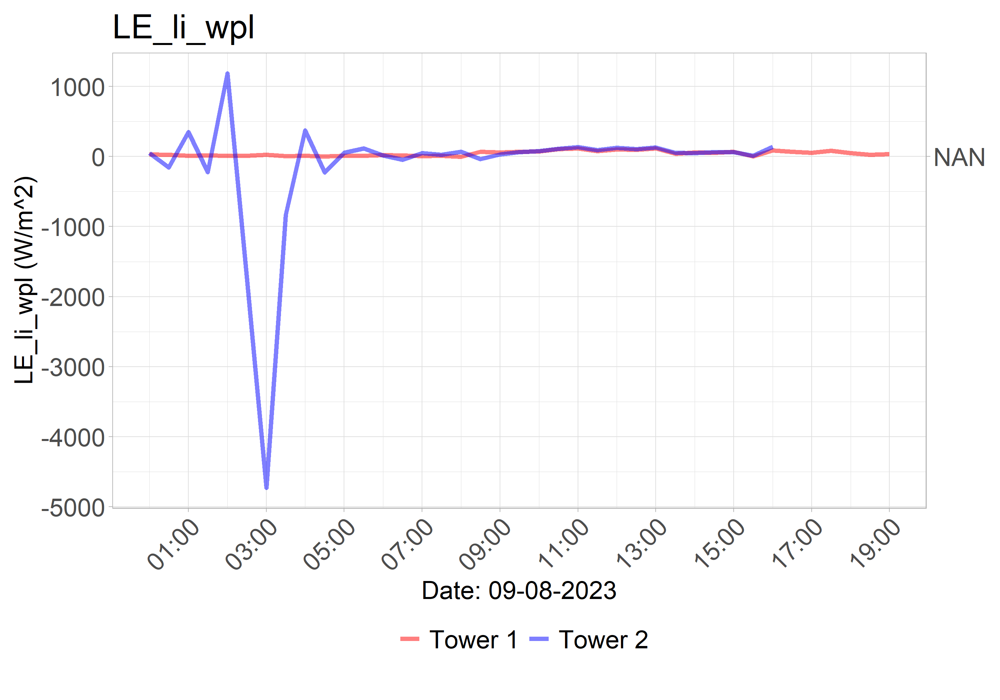
    </a>
  

  

  <!-- Fluxtower 3_4 Plots -->
  

    <h4>Flux Towers 3 & 4 - Yesterday</h4>
    <a href="fluxtower3_4/daily_plots/fluxtower3_4_LE_li_wpl_yesterday.png" target="_blank">
      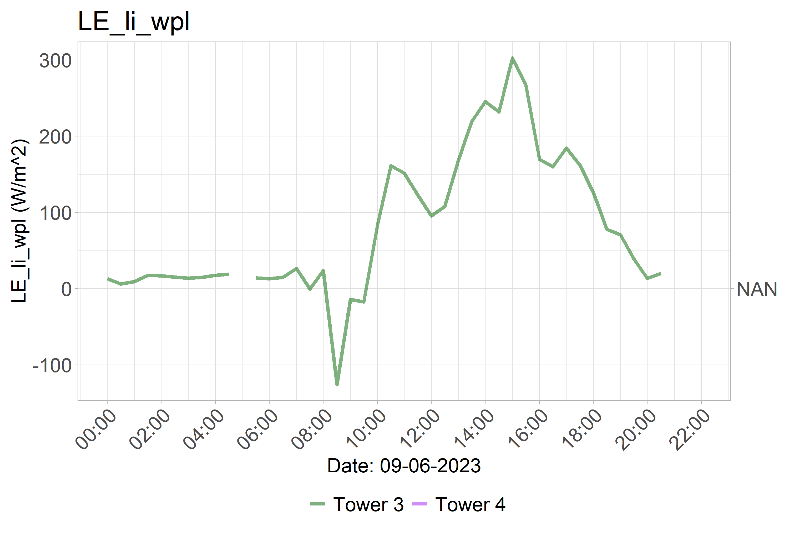
    </a>
  

  

    <h4>Flux Towers 3 & 4 - Today</h4>
    <a href="fluxtower3_4/daily_plots/fluxtower3_4_LE_li_wpl_today.png" target="_blank">
      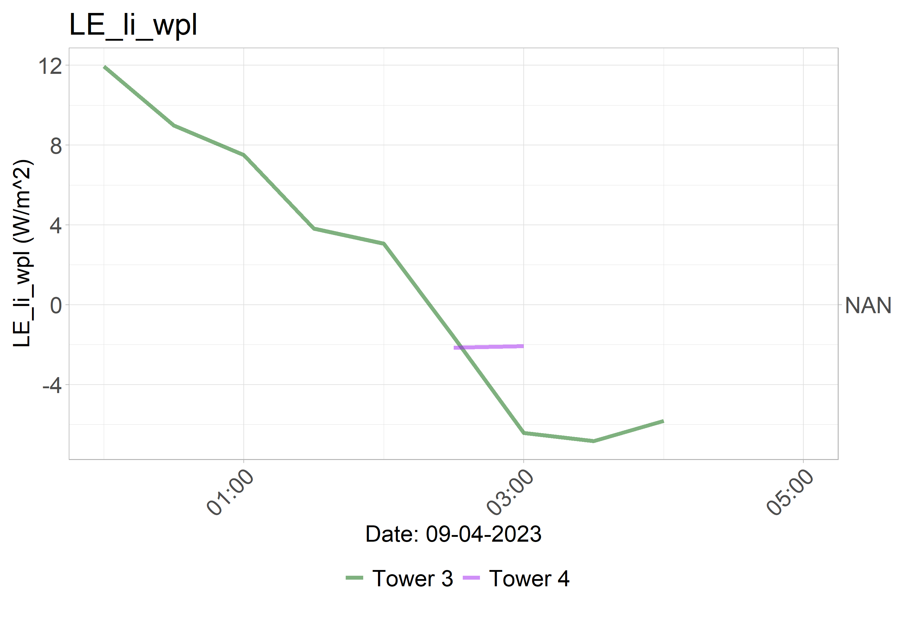
    </a>
  

<!-- end LE_li_wpl: -->
            
            

 <!-- This is the closing tag for content div under Latent Heat Flux -->

 <!-- This is the closing tag for collapsibleContainer div under Latent Heat Flux -->
<!-- END Latent Heat Flux section: -->
 
 
 <!-- Sensible Heat Flux Flux section: -->

<button class="collapsible sensible">Sensible Heat Flux</button>

<!-- Start Hs: -->
<h2>Hs (Hs)</h2>

  <!-- Fluxtower 1_2 Plots -->
  

    <h4>Flux Towers 1 & 2 - Yesterday</h4>
    <a href="fluxtower1_2/daily_plots/fluxtower1_2_Hs_yesterday.png" target="_blank">
      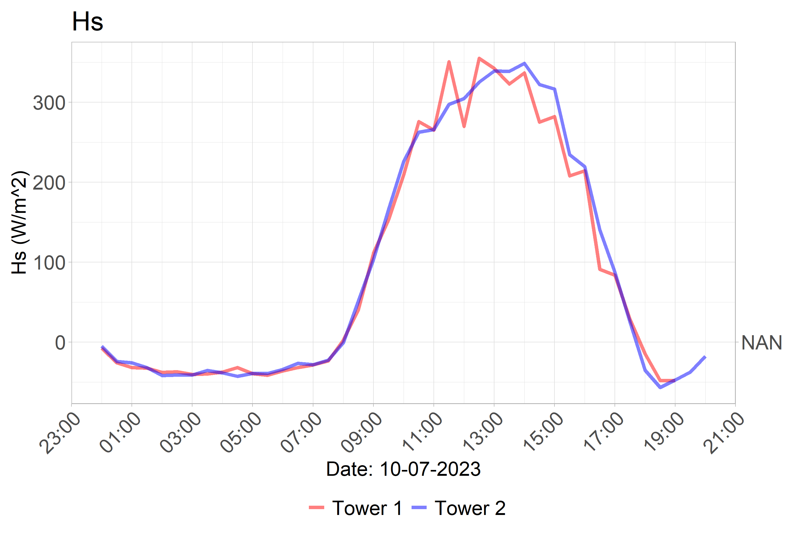
    </a>
  

  

    <h4>Flux Towers 1 & 2 - Today</h4>
    <a href="fluxtower1_2/daily_plots/fluxtower1_2_Hs_today.png" target="_blank">
      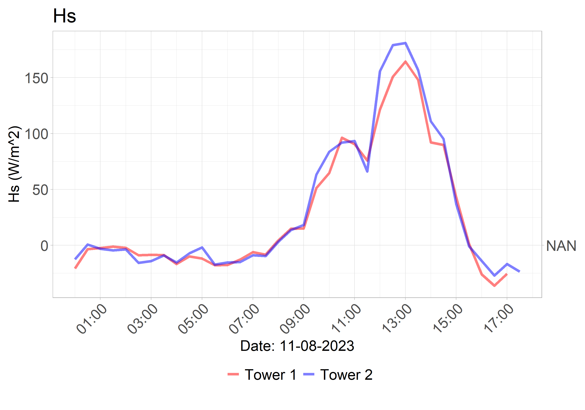
    </a>
  

  

  <!-- Fluxtower 3_4 Plots -->
  

    <h4>Flux Towers 3 & 4 - Yesterday</h4>
    <a href="fluxtower3_4/daily_plots/fluxtower3_4_Hs_yesterday.png" target="_blank">
      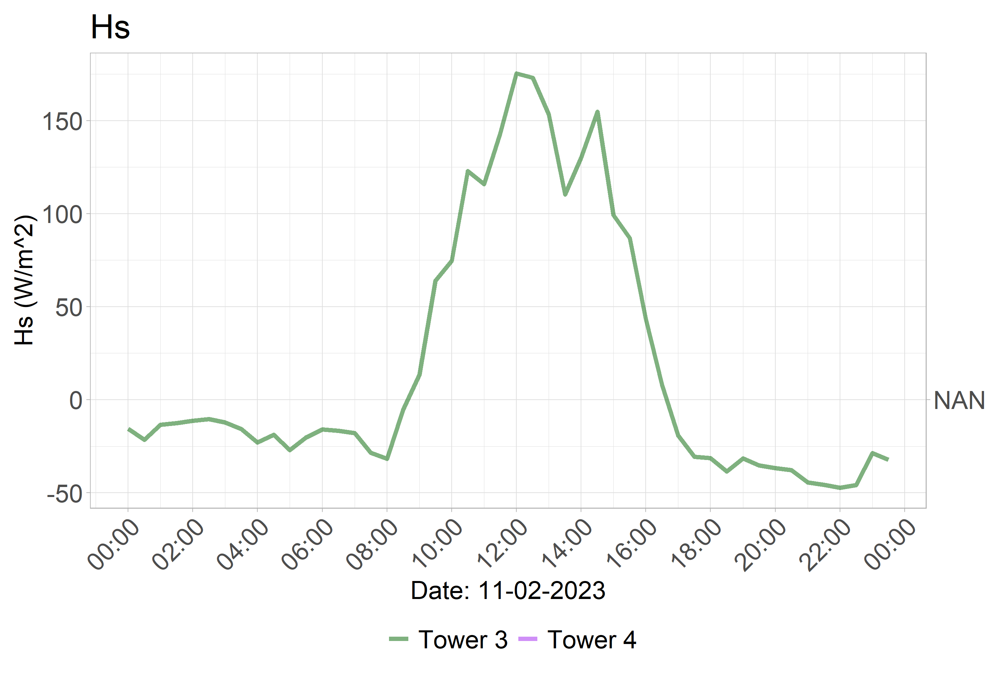
    </a>
  

  

    <h4>Flux Towers 3 & 4 - Today</h4>
    <a href="fluxtower3_4/daily_plots/fluxtower3_4_Hs_today.png" target="_blank">
      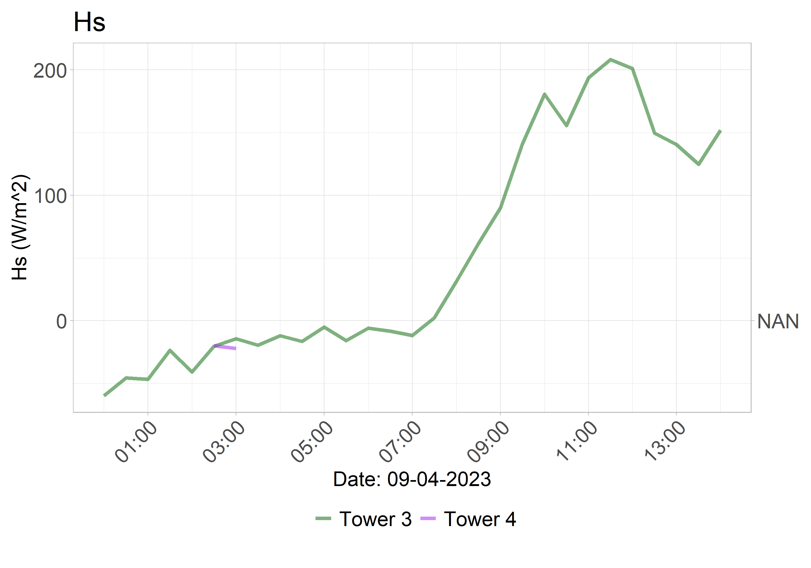
    </a>
  

<!-- end Hs: -->
            

 <!-- This is the closing tag for content div under Latent Heat Flux -->

 <!-- This is the closing tag for collapsibleContainer div under Latent Heat Flux -->
<!-- END sensible Flux section: -->

<!-- Wind section: -->

<button class="collapsible wind">Wind</button>

<!-- Start u_star: -->
<h2>U* (u_star)</h2>

  <!-- Fluxtower 1_2 Plots -->
  

    <h4>Flux Towers 1 & 2 - Yesterday</h4>
    <a href="fluxtower1_2/daily_plots/fluxtower1_2_u_star_yesterday.png" target="_blank">
      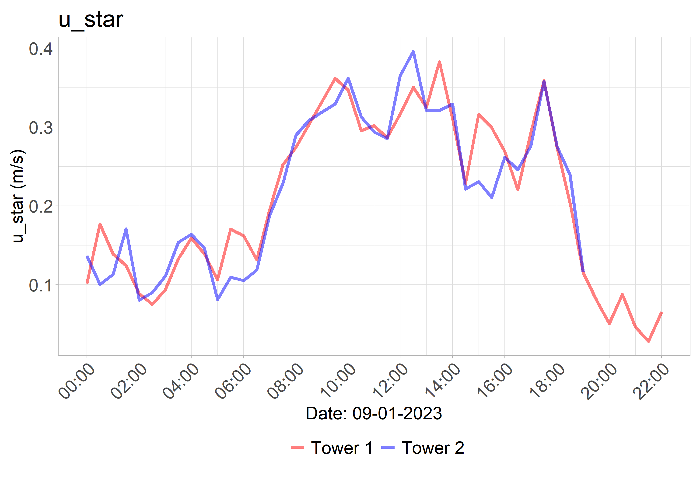
    </a>
  

  

    <h4>Flux Towers 1 & 2 - Today</h4>
    <a href="fluxtower1_2/daily_plots/fluxtower1_2_u_star_today.png" target="_blank">
      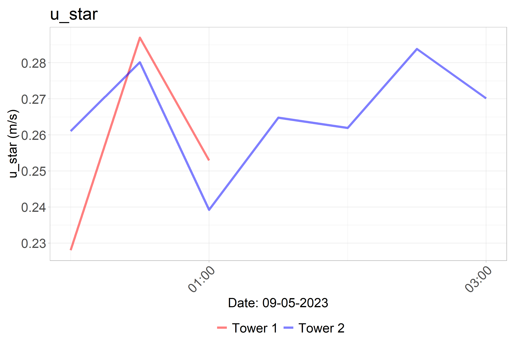
    </a>
  

  

  <!-- Fluxtower 3_4 Plots -->
  

    <h4>Flux Towers 3 & 4 - Yesterday</h4>
    <a href="fluxtower3_4/daily_plots/fluxtower3_4_u_star_yesterday.png" target="_blank">
      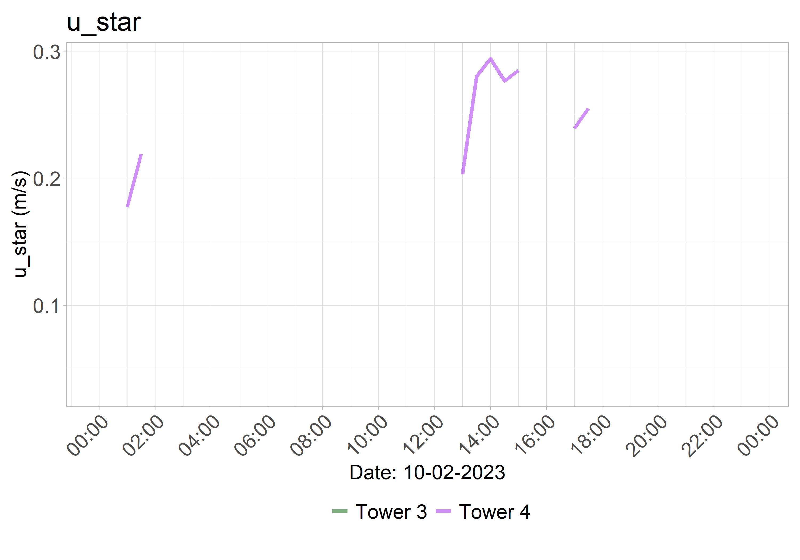
    </a>
  

  

    <h4>Flux Towers 3 & 4 - Today</h4>
    <a href="fluxtower3_4/daily_plots/fluxtower3_4_u_star_today.png" target="_blank">
      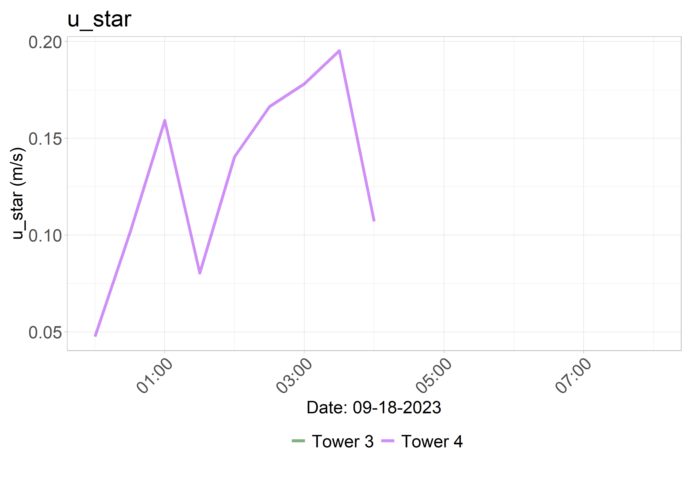
    </a>
  

<!-- end u_star: -->
            
<!-- Start wnd_spd: -->
<h2>Wind Speed (wnd_spd)</h2>

  <!-- Fluxtower 1_2 Plots -->
  

    <h4>Flux Towers 1 & 2 - Yesterday</h4>
    <a href="fluxtower1_2/daily_plots/fluxtower1_2_wnd_spd_yesterday.png" target="_blank">
      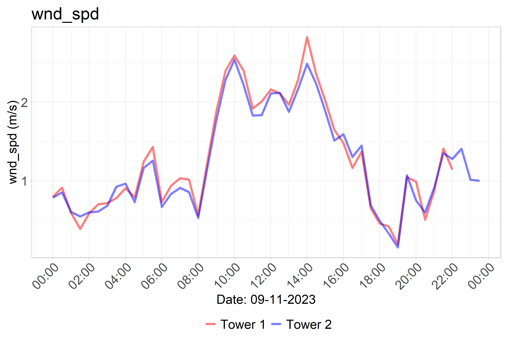
    </a>
  

  

    <h4>Flux Towers 1 & 2 - Today</h4>
    <a href="fluxtower1_2/daily_plots/fluxtower1_2_wnd_spd_today.png" target="_blank">
      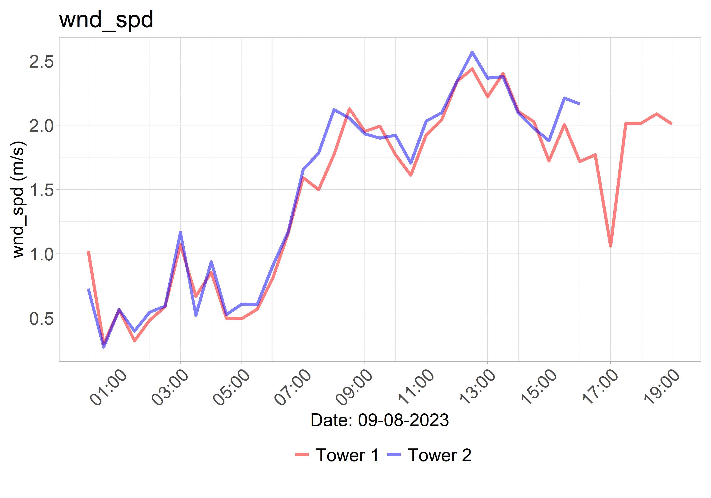
    </a>
  

  

  <!-- Fluxtower 3_4 Plots -->
  

    <h4>Flux Towers 3 & 4 - Yesterday</h4>
    <a href="fluxtower3_4/daily_plots/fluxtower3_4_wnd_spd_yesterday.png" target="_blank">
      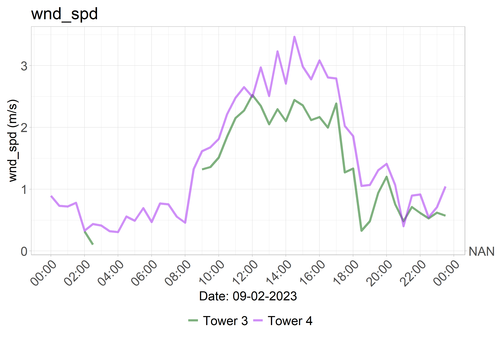
    </a>
  

  

    <h4>Flux Towers 3 & 4 - Today</h4>
    <a href="fluxtower3_4/daily_plots/fluxtower3_4_wnd_spd_today.png" target="_blank">
      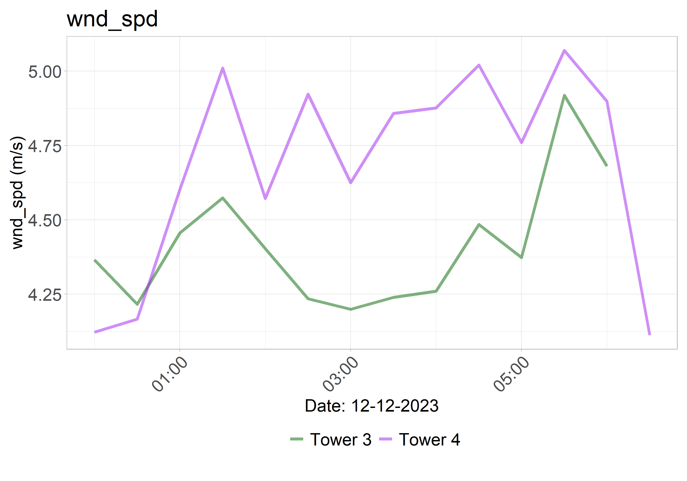
    </a>
  

<!-- end wnd_spd: -->

<!-- Start Uz_Avg: -->
<h2>Average Uz (Uz_Avg)</h2>

  <!-- Fluxtower 1_2 Plots -->
  

    <h4>Flux Towers 1 & 2 - Yesterday</h4>
    <a href="fluxtower1_2/daily_plots/fluxtower1_2_Uz_Avg_yesterday.png" target="_blank">
      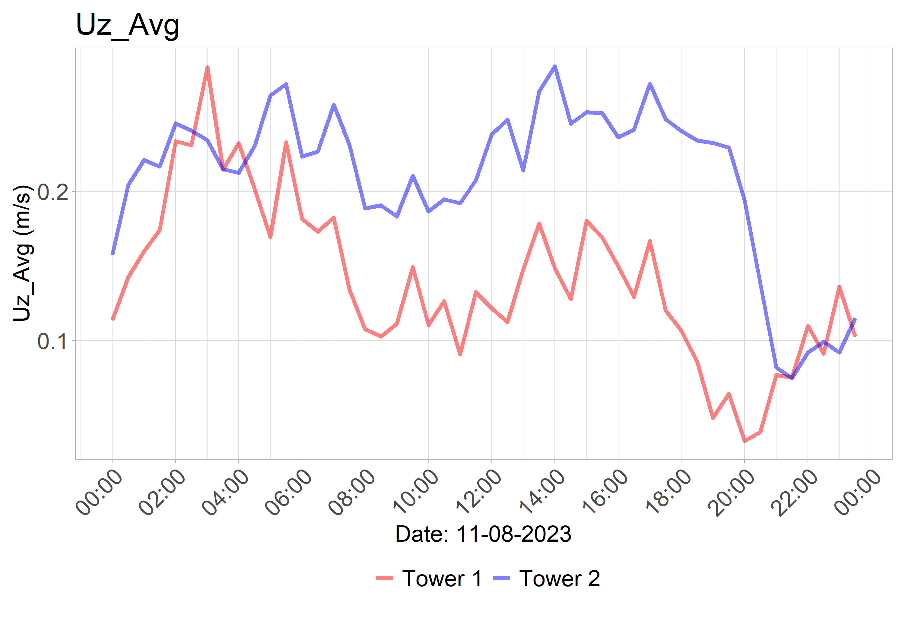
    </a>
  

  

    <h4>Flux Towers 1 & 2 - Today</h4>
    <a href="fluxtower1_2/daily_plots/fluxtower1_2_Uz_Avg_today.png" target="_blank">
      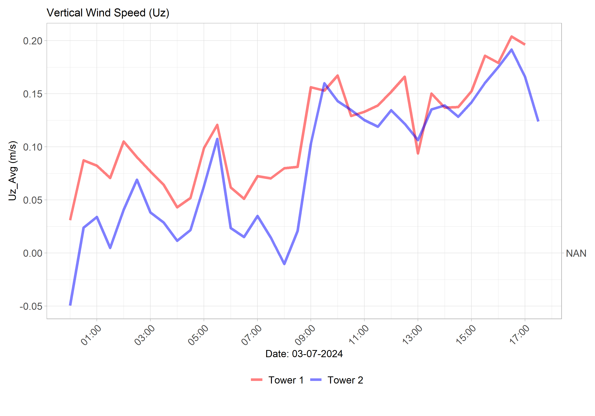
    </a>
  

  

  <!-- Fluxtower 3_4 Plots -->
  

    <h4>Flux Towers 3 & 4 - Yesterday</h4>
    <a href="fluxtower3_4/daily_plots/fluxtower3_4_Uz_Avg_yesterday.png" target="_blank">
      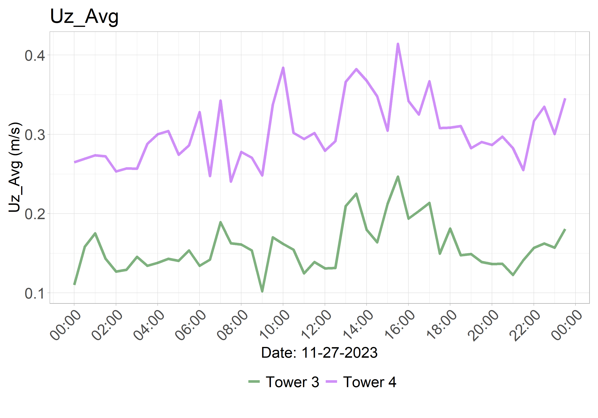
    </a>
  

  

    <h4>Flux Towers 3 & 4 - Today</h4>
    <a href="fluxtower3_4/daily_plots/fluxtower3_4_Uz_Avg_today.png" target="_blank">
      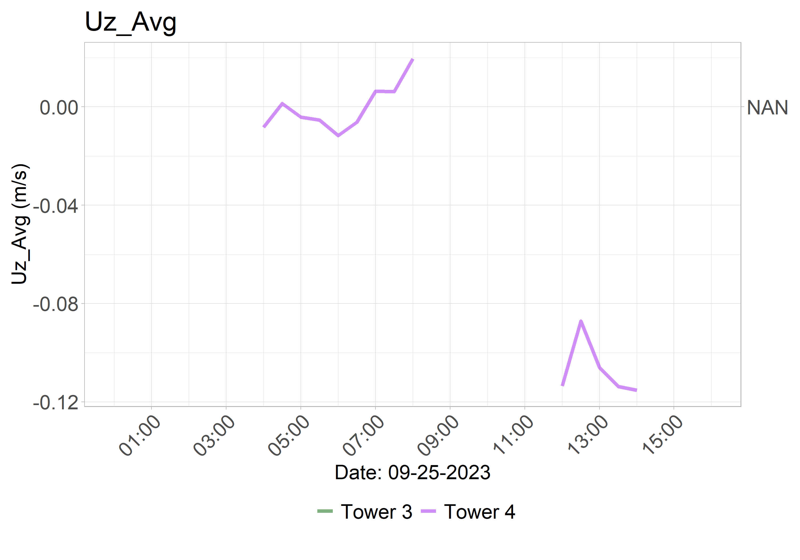
    </a>
  

<!-- end Uz_Avg: -->
            
            
<!-- Start Uz_stdev: -->
<h2>Uz Standard Deviation (Uz_stdev)</h2>

  <!-- Fluxtower 1_2 Plots -->
  

    <h4>Flux Towers 1 & 2 - Yesterday</h4>
    <a href="fluxtower1_2/daily_plots/fluxtower1_2_Uz_stdev_yesterday.png" target="_blank">
      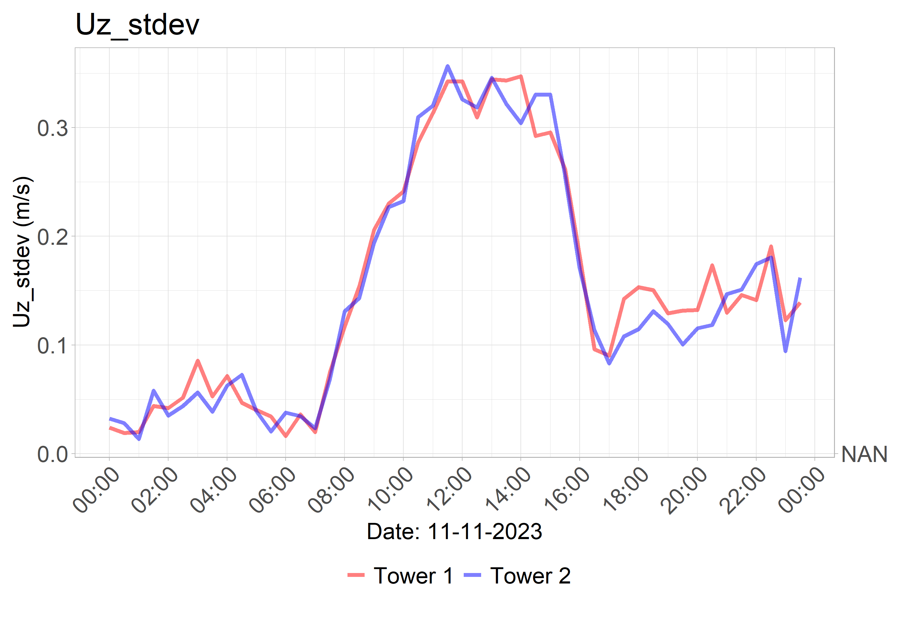
    </a>
  

  

    <h4>Flux Towers 1 & 2 - Today</h4>
    <a href="fluxtower1_2/daily_plots/fluxtower1_2_Uz_stdev_today.png" target="_blank">
      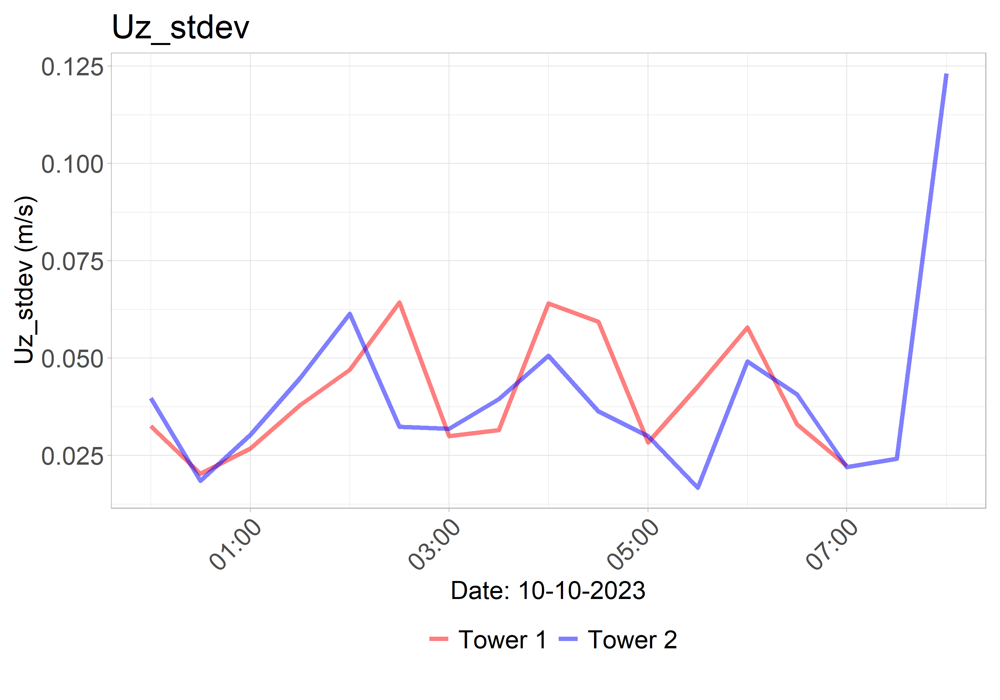
    </a>
  

  

  <!-- Fluxtower 3_4 Plots -->
  

    <h4>Flux Towers 3 & 4 - Yesterday</h4>
    <a href="fluxtower3_4/daily_plots/fluxtower3_4_Uz_stdev_yesterday.png" target="_blank">
      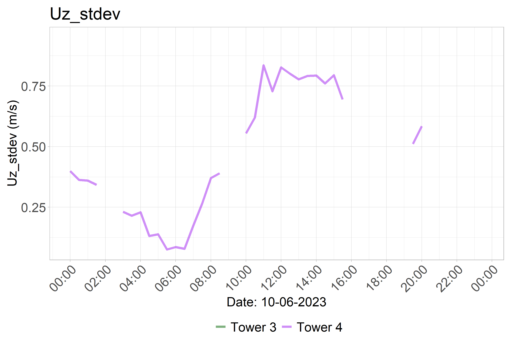
    </a>
  

  

    <h4>Flux Towers 3 & 4 - Today</h4>
    <a href="fluxtower3_4/daily_plots/fluxtower3_4_Uz_stdev_today.png" target="_blank">
      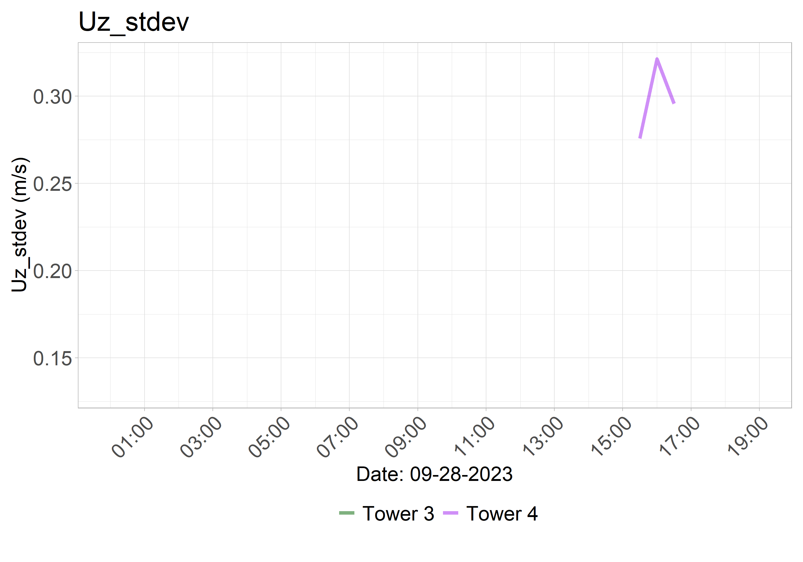
    </a>
  

<!-- end Uz_stdev: -->
            
            
            
            

 <!-- This is the closing tag for content div under Latent Heat Flux -->

 <!-- This is the closing tag for collapsibleContainer div under Latent Heat Flux -->
<!-- END Latent Heat Flux section: -->

<!-- Wind section: -->

<button class="collapsible soil">Soil</button>

<!-- Start Soil Water Content Section-->
<h1>Soil Water Content</h1>
<!-- Start soil_water_Avg.1: -->
<h2>Soil Water Content, Level 1 (soil_water_Avg.1)</h2>

  <!-- Fluxtower 1_2 Plots -->
  

    <h4>Flux Towers 1 & 2 - Yesterday</h4>
    
  

  

    <h4>Flux Towers 1 & 2 - Today</h4>
    
  

  

  <!-- Fluxtower 3_4 Plots -->
  

    <h4>Flux Towers 3 & 4 - Yesterday</h4>
    
  

  

    <h4>Flux Towers 3 & 4 - Today</h4>
    
  

<!-- end soil_water_Avg.1: -->

<!-- Start soil_water_Avg.2: -->
<h2>Soil Water Content, Level 2 (soil_water_Avg.2)</h2>

  <!-- Fluxtower 1_2 Plots -->
  

    <h4>Flux Towers 1 & 2 - Yesterday</h4>
    
  

  

    <h4>Flux Towers 1 & 2 - Today</h4>
    
  

  

  <!-- Fluxtower 3_4 Plots -->
  

    <h4>Flux Towers 3 & 4 - Yesterday</h4>
    
  

  

    <h4>Flux Towers 3 & 4 - Today</h4>
    
  

<!-- end soil_water_Avg.2: -->

<!-- Start soil_water_Avg.3: -->
<h2>Soil Water Content, Level 3 (soil_water_Avg.3)</h2>

  <!-- Fluxtower 1_2 Plots -->
  

    <h4>Flux Towers 1 & 2 - Yesterday</h4>
    
  

  

    <h4>Flux Towers 1 & 2 - Today</h4>
    
  

  

  <!-- Fluxtower 3_4 Plots -->
  

    <h4>Flux Towers 3 & 4 - Yesterday</h4>
    
  

  

    <h4>Flux Towers 3 & 4 - Today</h4>
    
  

<!-- end soil_water_Avg.3: -->
            
<!-- Start Soil Temp: -->
<h1>Soil Temperature</h1>

<!-- Start Tsoil1_Avg: -->
<h2>Soil Temperature, Level 1 (Tsoil1_Avg)</h2>

  <!-- Fluxtower 1_2 Plots -->
  

    <h4>Flux Towers 1 & 2 - Yesterday</h4>
    <a href="fluxtower1_2/daily_plots/fluxtower1_2_Tsoil1_Avg_yesterday.png" target="_blank">
      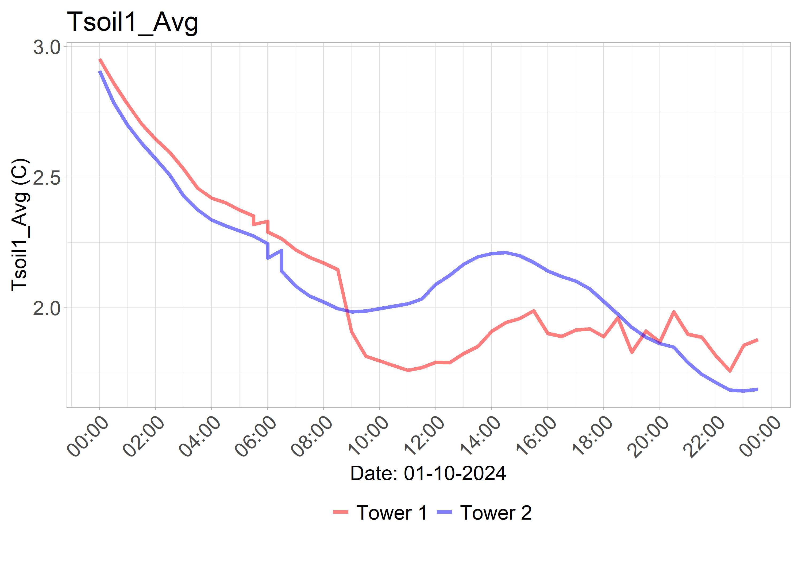
    </a>
  

  

    <h4>Flux Towers 1 & 2 - Today</h4>
    <a href="fluxtower1_2/daily_plots/fluxtower1_2_Tsoil1_Avg_today.png" target="_blank">
      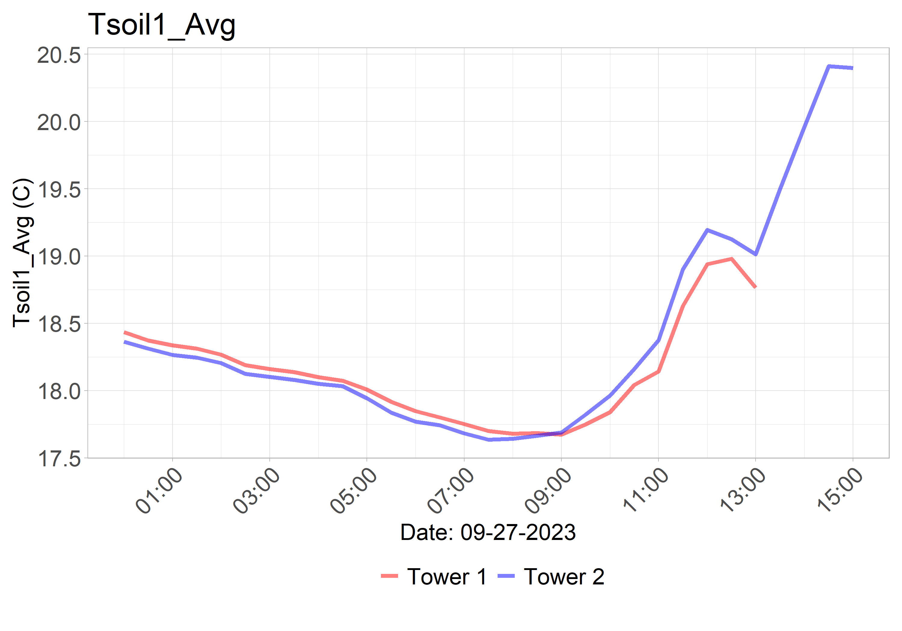
    </a>
  

  

  <!-- Fluxtower 3_4 Plots -->
  

    <h4>Flux Towers 3 & 4 - Yesterday</h4>
    <a href="fluxtower3_4/daily_plots/fluxtower3_4_Tsoil1_Avg_yesterday.png" target="_blank">
      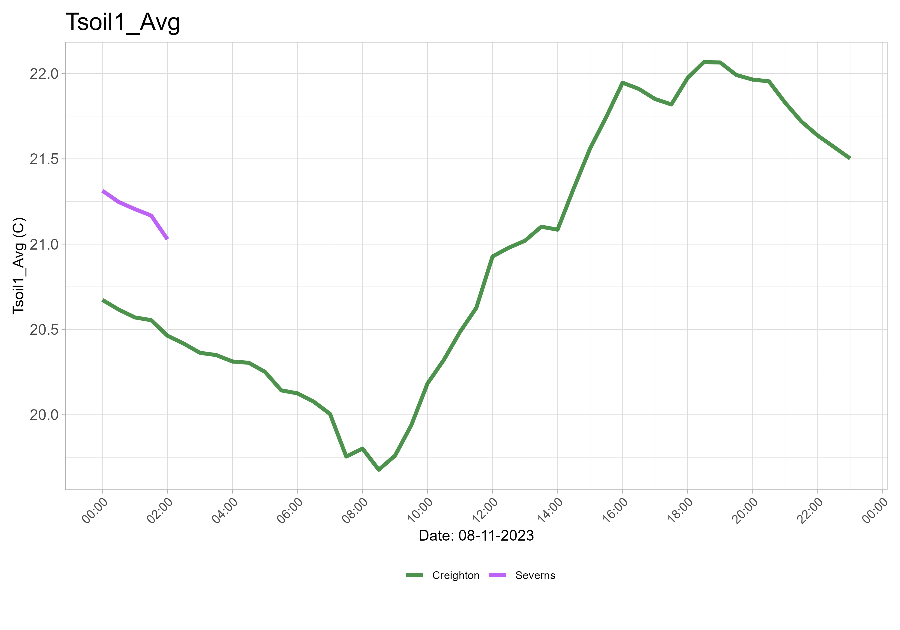
    </a>
  

  

    <h4>Flux Towers 3 & 4 - Today</h4>
    <a href="fluxtower3_4/daily_plots/fluxtower3_4_Tsoil1_Avg_today.png" target="_blank">
      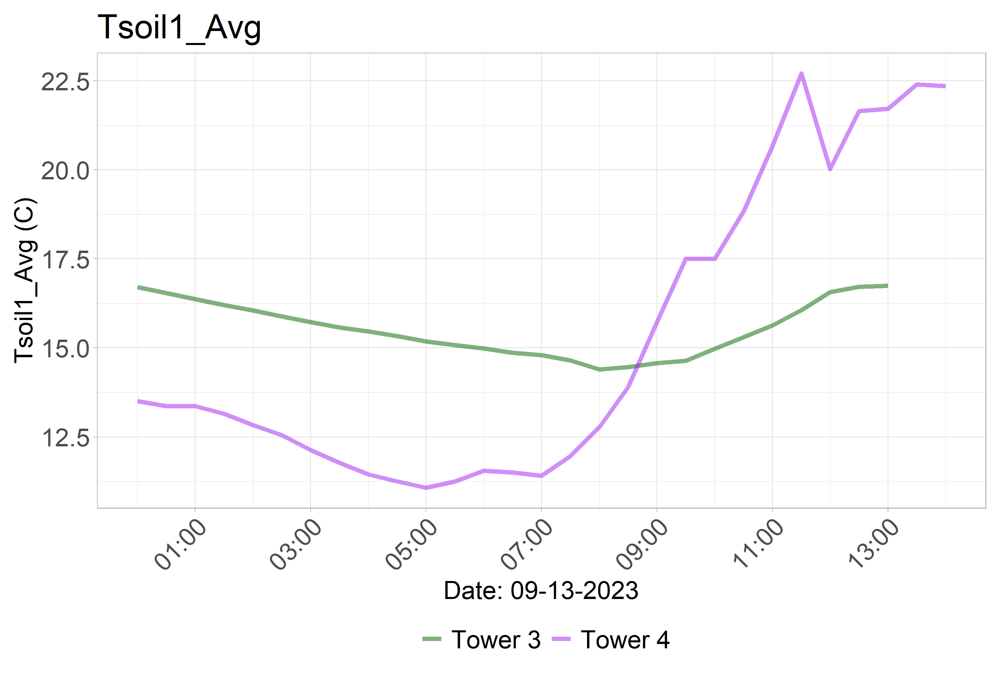
    </a>
  

<!-- end Tsoil1_Avg: -->
            
<!-- Start Tsoil2_Avg: -->
<h2>Soil Temperature, Level 2 (Tsoil2_Avg)</h2>

  <!-- Fluxtower 1_2 Plots -->
  

    <h4>Flux Towers 1 & 2 - Yesterday</h4>
    <a href="fluxtower1_2/daily_plots/fluxtower1_2_Tsoil2_Avg_yesterday.png" target="_blank">
      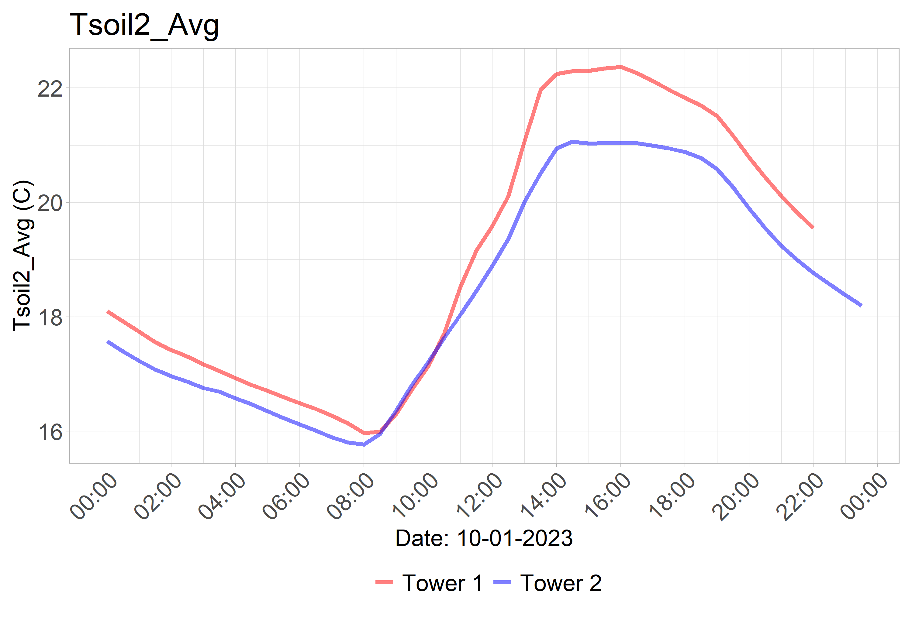
    </a>
  

  

    <h4>Flux Towers 1 & 2 - Today</h4>
    <a href="fluxtower1_2/daily_plots/fluxtower1_2_Tsoil2_Avg_today.png" target="_blank">
      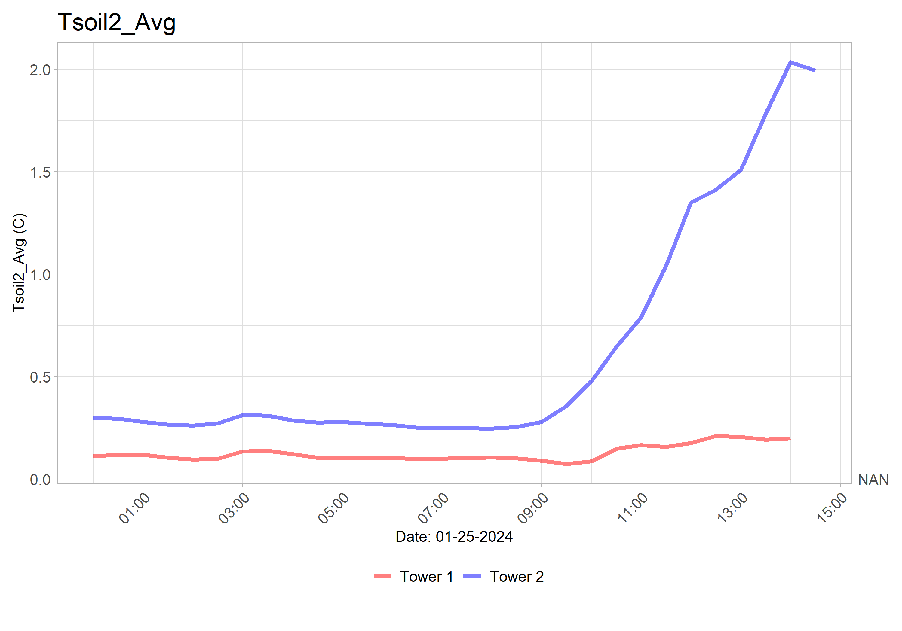
    </a>
  

  

  <!-- Fluxtower 3_4 Plots -->
  

    <h4>Flux Towers 3 & 4 - Yesterday</h4>
    <a href="fluxtower3_4/daily_plots/fluxtower3_4_Tsoil2_Avg_yesterday.png" target="_blank">
      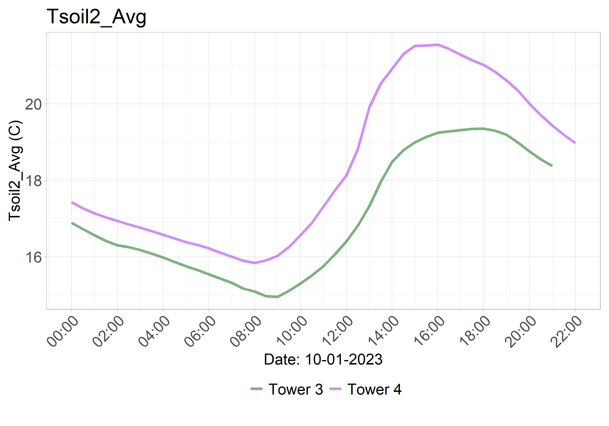
    </a>
  

  

    <h4>Flux Towers 3 & 4 - Today</h4>
    <a href="fluxtower3_4/daily_plots/fluxtower3_4_Tsoil2_Avg_today.png" target="_blank">
      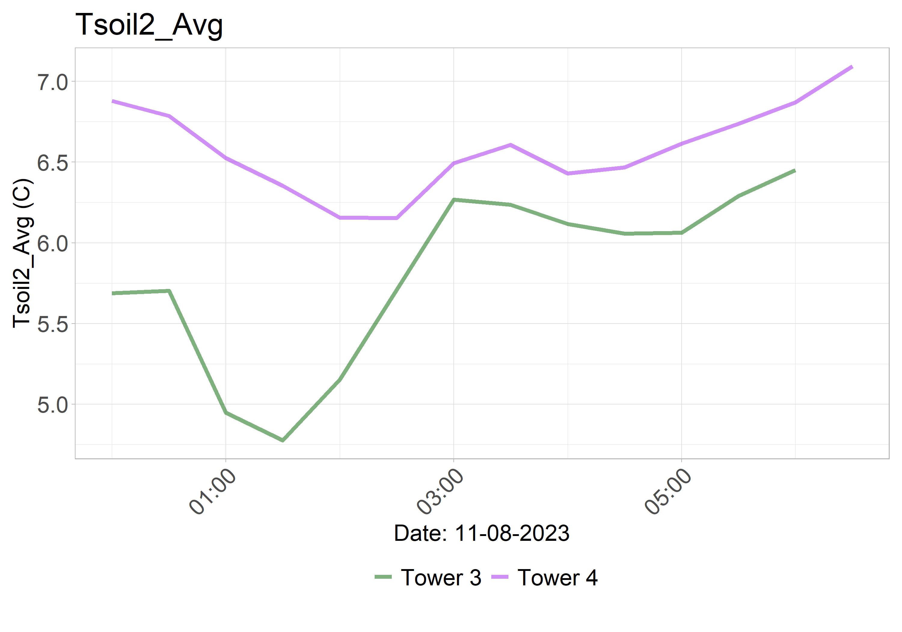
    </a>
  

<!-- end Tsoil2_Avg: -->

<!-- Start Tsoil3_Avg: -->
<h2>Soil Temperature, Level 3 (Tsoil3_Avg)</h2>

  <!-- Fluxtower 1_2 Plots -->
  

    <h4>Flux Towers 1 & 2 - Yesterday</h4>
    <a href="fluxtower1_2/daily_plots/fluxtower1_2_Tsoil3_Avg_yesterday.png" target="_blank">
      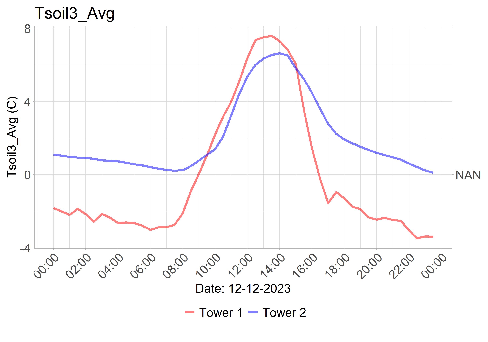
    </a>
  

  

    <h4>Flux Towers 1 & 2 - Today</h4>
    <a href="fluxtower1_2/daily_plots/fluxtower1_2_Tsoil3_Avg_today.png" target="_blank">
      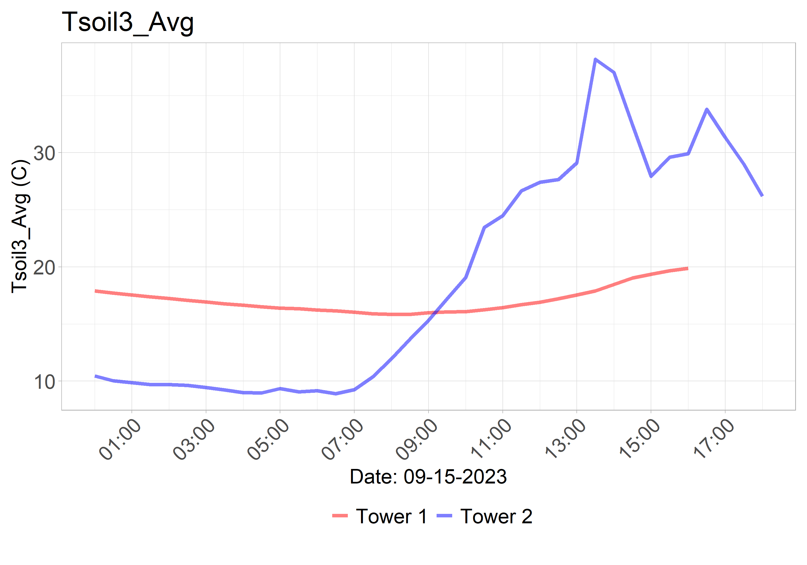
    </a>
  

  

  <!-- Fluxtower 3_4 Plots -->
  

    <h4>Flux Towers 3 & 4 - Yesterday</h4>
    <a href="fluxtower3_4/daily_plots/fluxtower3_4_Tsoil3_Avg_yesterday.png" target="_blank">
      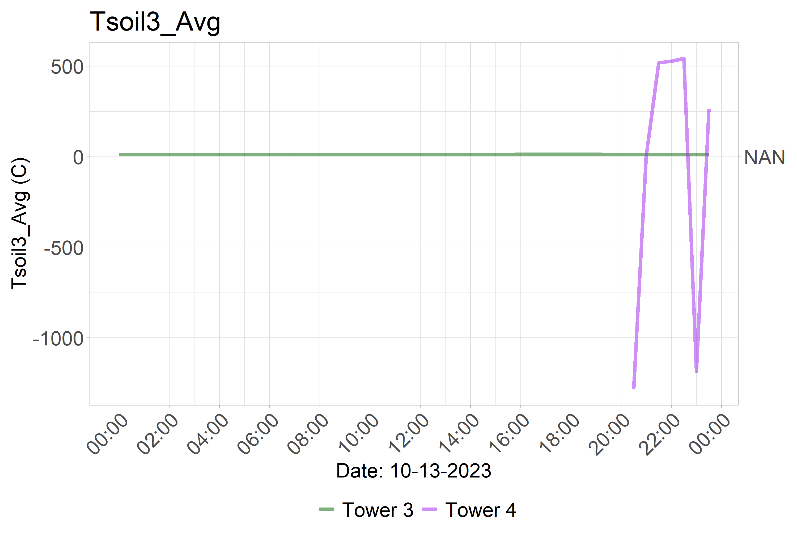
    </a>
  

  

    <h4>Flux Towers 3 & 4 - Today</h4>
    <a href="fluxtower3_4/daily_plots/fluxtower3_4_Tsoil3_Avg_today.png" target="_blank">
      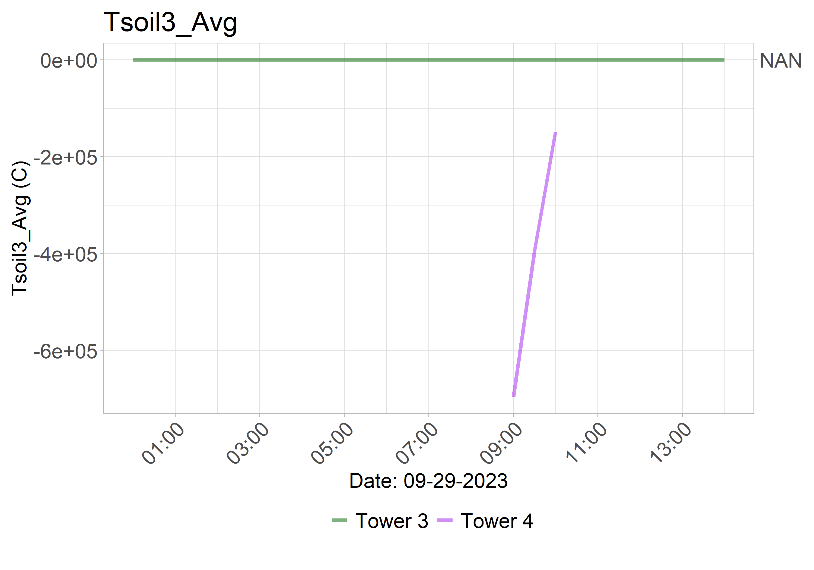
    </a>
  

<!-- end Tsoil3_Avg: -->
            
            
<!-- Start Tsoil4_Avg: -->
<h2>Soil Temperature, Level 4 (Tsoil4_Avg)</h2>

  <!-- Fluxtower 1_2 Plots -->
  

    <h4>Flux Towers 1 & 2 - Yesterday</h4>
    
  

  

    <h4>Flux Towers 1 & 2 - Today</h4>
    
  

  

  <!-- Fluxtower 3_4 Plots -->
  

    <h4>Flux Towers 3 & 4 - Yesterday</h4>
    
  

  

    <h4>Flux Towers 3 & 4 - Today</h4>
    
  

<!-- end Tsoil4_Avg: -->
            
            
            

 <!-- This is the closing tag for content div under Soil -->

 <!-- This is the closing tag for collapsibleContainer div under Soil -->
<!-- END Soil section: -->
 
 
 
 <!-- battery section: -->

<button class="collapsible battery">Battery</button>

<!-- Start batt_volt_Avg: -->
<h2>Battery Data (batt_volt_Avg)</h2>

  <!-- Fluxtower 1_2 Plots -->
  

    <h4>Flux Towers 1 & 2 - Yesterday</h4>
    <a href="fluxtower1_2/daily_plots/fluxtower1_2_batt_volt_Avg_yesterday.png" target="_blank">
      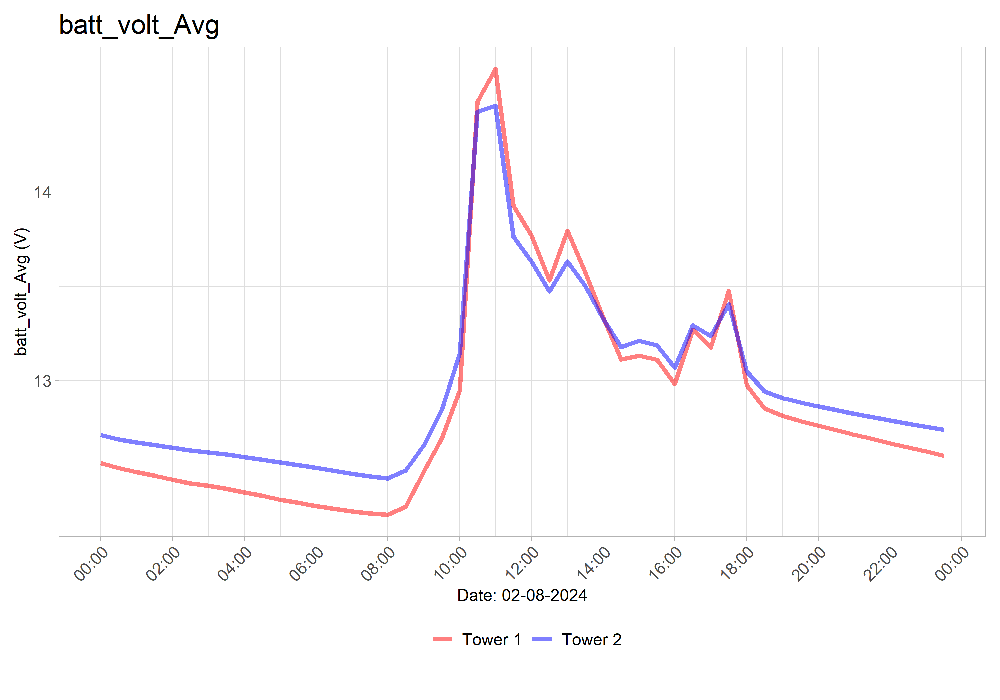
    </a>
  

  

    <h4>Flux Towers 1 & 2 - Today</h4>
    <a href="fluxtower1_2/daily_plots/fluxtower1_2_batt_volt_Avg_today.png" target="_blank">
      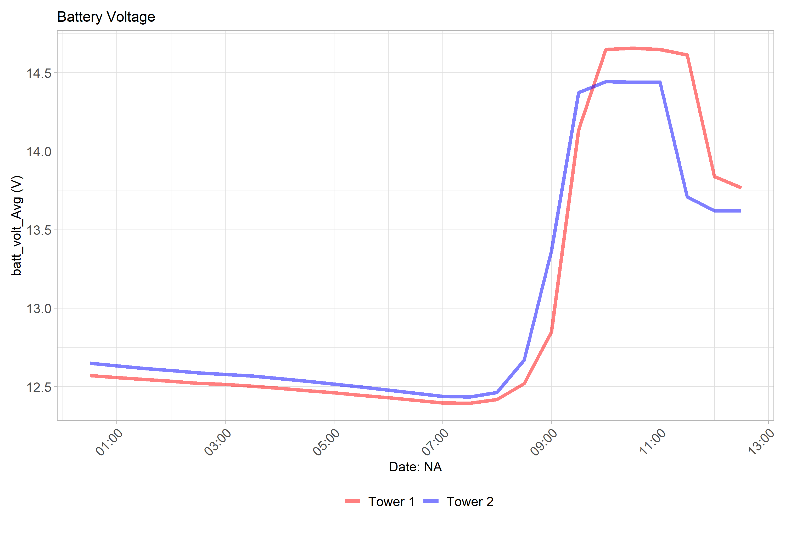
    </a>
  

  

  <!-- Fluxtower 3_4 Plots -->
  

    <h4>Flux Towers 3 & 4 - Yesterday</h4>
    <a href="fluxtower3_4/daily_plots/fluxtower3_4_batt_volt_Avg_yesterday.png" target="_blank">
      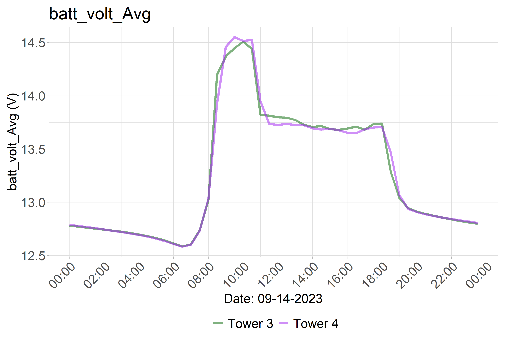
    </a>
  

  

    <h4>Flux Towers 3 & 4 - Today</h4>
    <a href="fluxtower3_4/daily_plots/fluxtower3_4_batt_volt_Avg_today.png" target="_blank">
      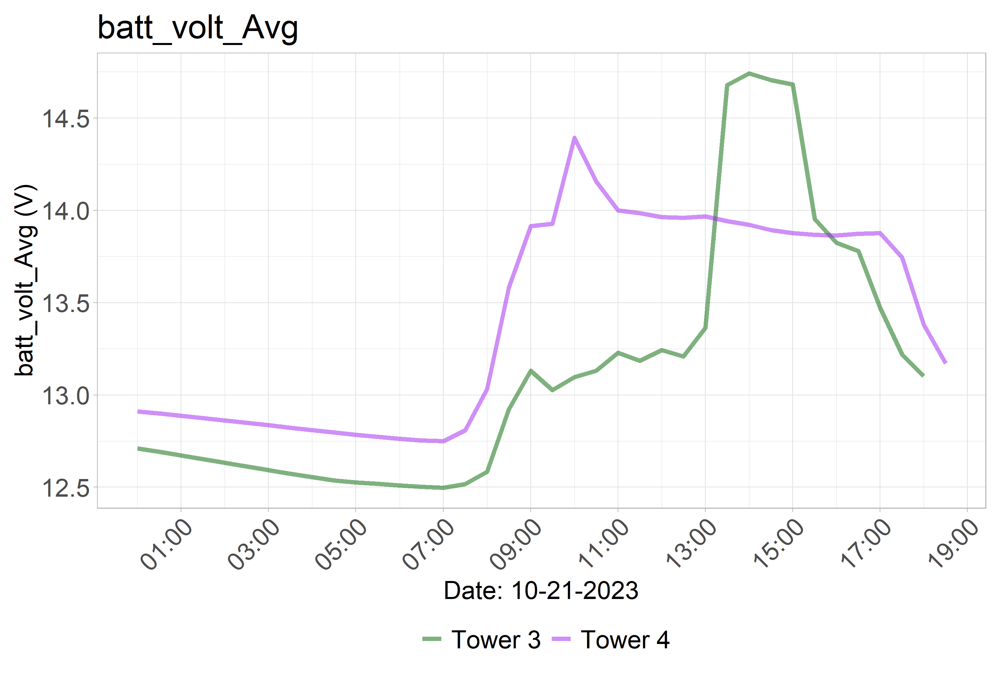
    </a>
  

<!-- end batt_volt_Avg: -->
            
            
<!-- Start cdm_batt_volt_Avg: -->
<h2>CDM Battery Data (cdm_batt_volt_Avg)</h2>

  <!-- Fluxtower 1_2 Plots -->
  

    <h4>Flux Towers 1 & 2 - Yesterday</h4>
    <a href="fluxtower1_2/daily_plots/fluxtower1_2_cdm_batt_volt_Avg_yesterday.png" target="_blank">
      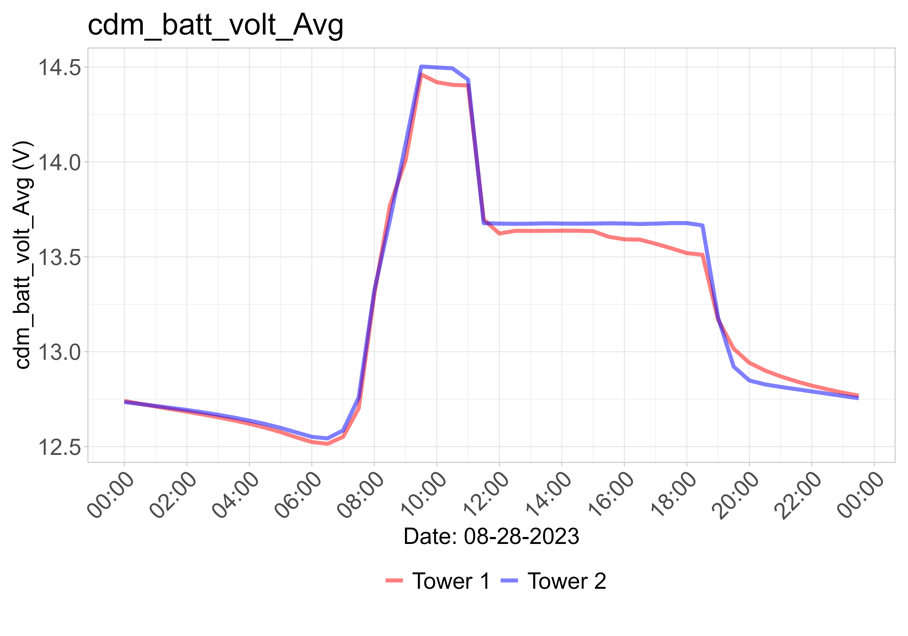
    </a>
  

  

    <h4>Flux Towers 1 & 2 - Today</h4>
    <a href="fluxtower1_2/daily_plots/fluxtower1_2_cdm_batt_volt_Avg_today.png" target="_blank">
      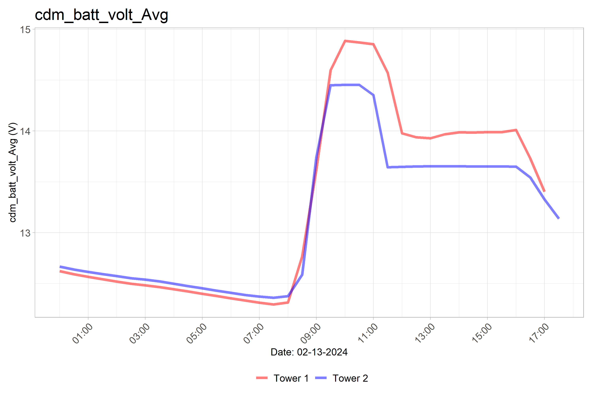
    </a>
  

  

  <!-- Fluxtower 3_4 Plots -->
  

    <h4>Flux Towers 3 & 4 - Yesterday</h4>
    <a href="fluxtower3_4/daily_plots/fluxtower3_4_cdm_batt_volt_Avg_yesterday.png" target="_blank">
      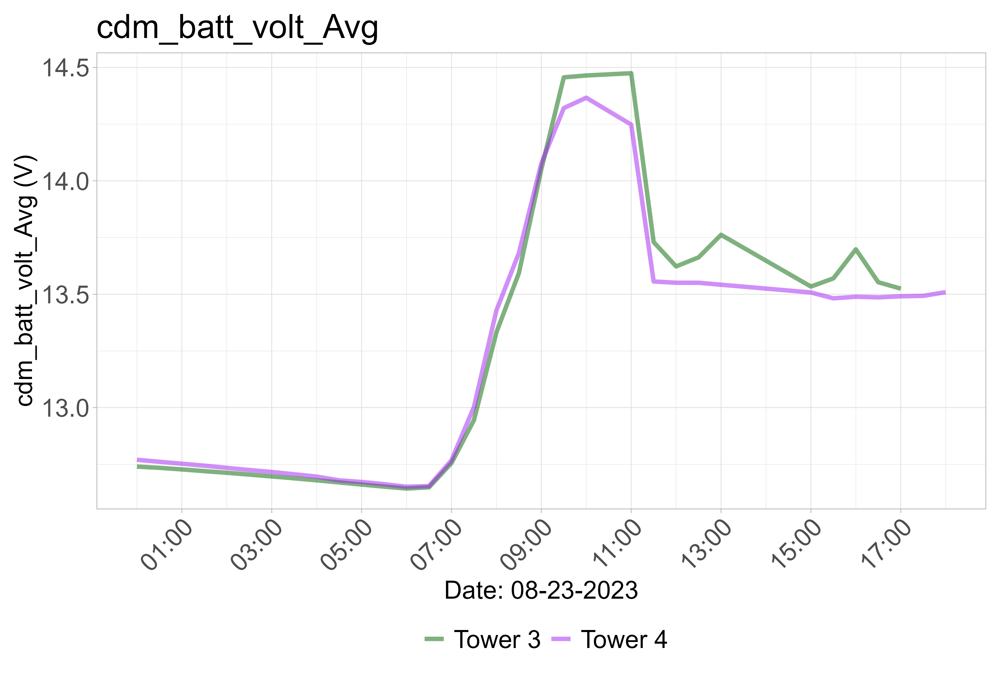
    </a>
  

  

    <h4>Flux Towers 3 & 4 - Today</h4>
    <a href="fluxtower3_4/daily_plots/fluxtower3_4_cdm_batt_volt_Avg_today.png" target="_blank">
      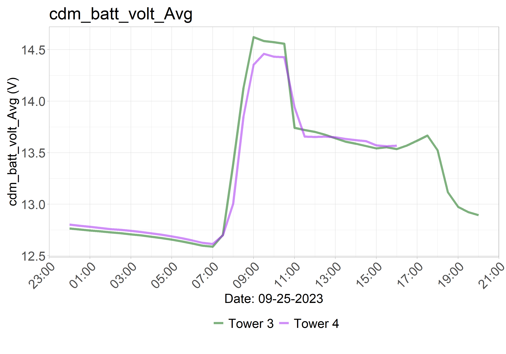
    </a>
  

<!-- end cdm_batt_volt_Avg: -->
            

 <!-- This is the closing tag for content div under Soil -->

 <!-- This is the closing tag for collapsibleContainer div under Soil -->
<!-- END Battery section: -->
 
