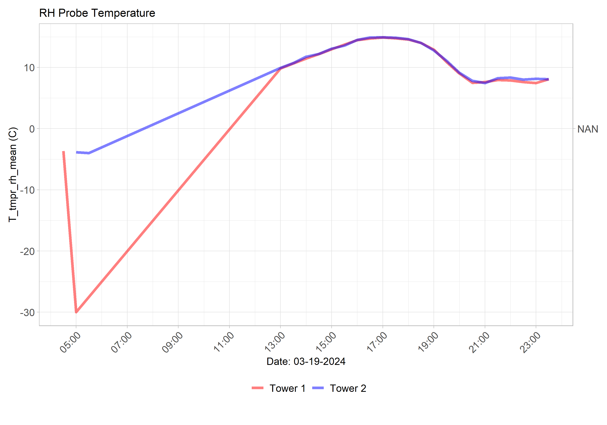

 
   
  
  
  
  

  <!-- This is an HTML comment, it won't appear on the page -->
<!-- Start site objects and things here: -->

<!-- Start Temperature section: -->

<button class="collapsible temperature">Temperature</button>

<!-- Start T_tmpr_rh_mean: -->
<h2>Air Temperature (T_tmpr_rh_mean)</h2>

  <!-- Fluxtower 1_2 Plots -->
  

    <h4>Flux Towers 1 & 2 - Yesterday</h4>
    
  

  

    <h4>Flux Towers 1 & 2 - Today</h4>
    
  

  

  <!-- Fluxtower 3_4 Plots -->
  

    <h4>Flux Towers 3 & 4 - Yesterday</h4>
    
  

  

    <h4>Flux Towers 3 & 4 - Today</h4>
    
  

<!-- end T_tmpr_rh_mean: -->
            
<!-- Start Ts_Avg: -->
<h2>Average Ts (Ts_Avg)</h2>

  <!-- Fluxtower 1_2 Plots -->
  

    <h4>Flux Towers 1 & 2 - Yesterday</h4>
    
  

  

    <h4>Flux Towers 1 & 2 - Today</h4>
    
  

  

  <!-- Fluxtower 3_4 Plots -->
  

    <h4>Flux Towers 3 & 4 - Yesterday</h4>
    
  

  

    <h4>Flux Towers 3 & 4 - Today</h4>
    
  

<!-- end Ts_Avg: -->

 <!-- This is the closing tag for content div under Temperature -->

 <!-- This is the closing tag for collapsibleContainer div under Temperature -->
<!-- END Temperature section: -->

<!-- Start Carbon Flux section: -->

<button class="collapsible Carbon Flux">Carbon Flux</button>

<!-- Start CO2_li_wpl_H_li: -->
<h2>Carbon Flux (CO2_li_wpl_H_li)</h2>

  <!-- Fluxtower 1_2 Plots -->
  

    <h4>Flux Towers 1 & 2 - Yesterday</h4>
    
  

  

    <h4>Flux Towers 1 & 2 - Today</h4>
    
  

  

  <!-- Fluxtower 3_4 Plots -->
  

    <h4>Flux Towers 3 & 4 - Yesterday</h4>
    
  

  

    <h4>Flux Towers 3 & 4 - Today</h4>
    
  

<!-- end CO2_li_wpl_H_li: -->
            

 <!-- This is the closing tag for content div under Carbon Flux -->

 <!-- This is the closing tag for collapsibleContainer div under Carbon Flux -->
<!-- END Carbon Flux section: -->
 